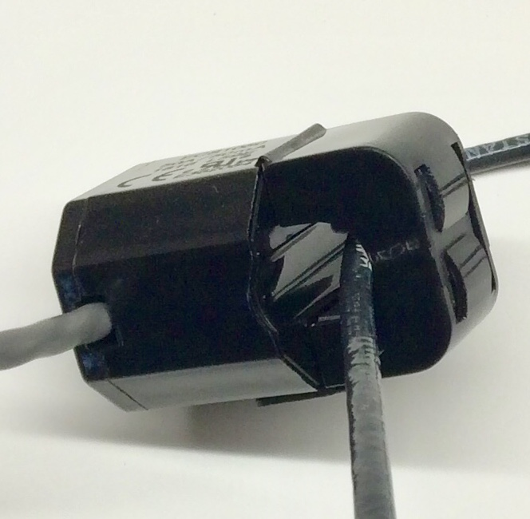
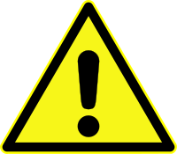
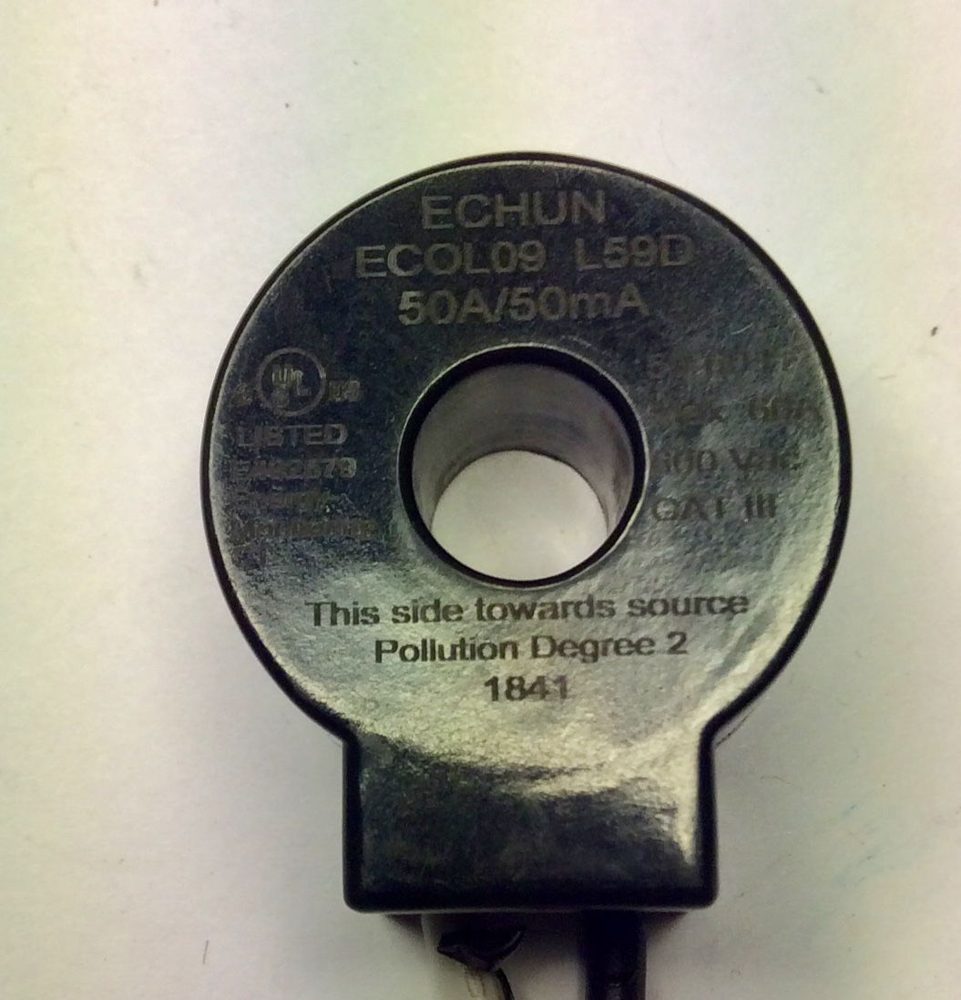
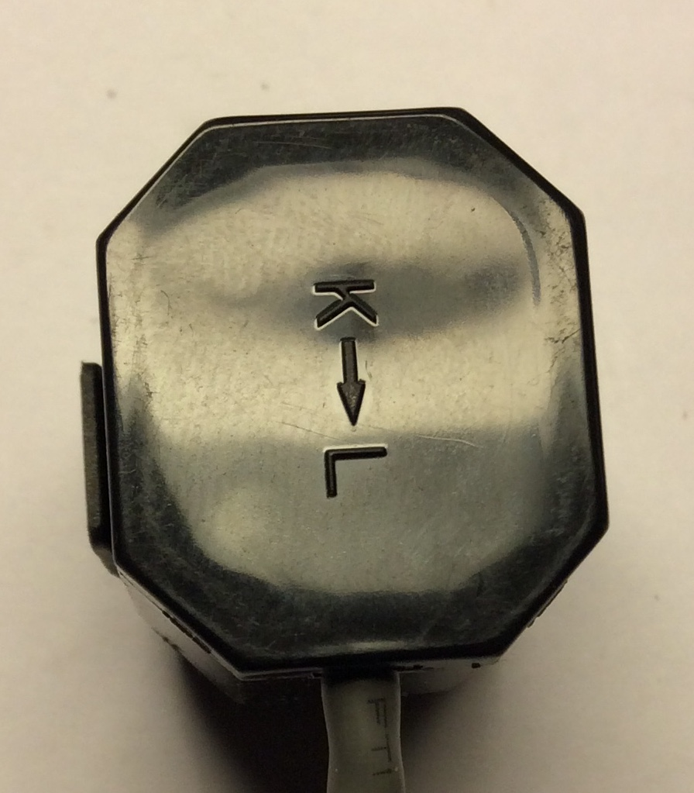
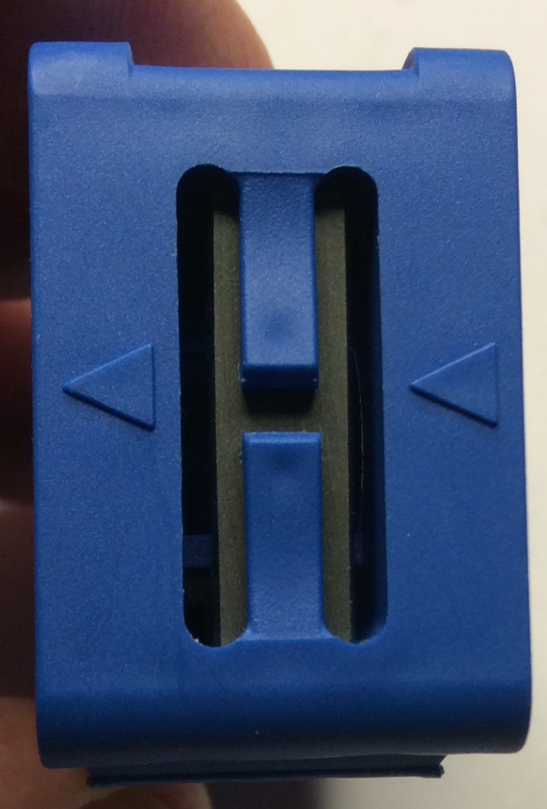

=========
CT Basics
=========

What is a Current Transformer?
------------------------------

`From Wikipedia <https://en.wikipedia.org/wiki/Current_transformer>`_:

    *A current transformer (CT) is a type of transformer that 
    is used to measure alternating current (AC). 
    It produces a current in its secondary which is 
    proportional to the current in its primary.* 

In our case, the primary is *one* of the conductors of the circuit
that we want to measure, and the secondary is the output jack
that plugs into the IoTaWatt.

So without connecting anything directly to any high-voltage
wiring, it's possible to get a scaled down measure of the
primary current that can be used to passively measure power 
(Watts) of a circuit.

Types of CTs
------------

CTs come in various types, sizes, and capacities, 
and are made for a variety of end uses. This tutorial
doesn't try to address all aspects.  That's what
Wikipedia does well.  Here we'll try to focus on the
CTs that are suited to use with the IoTaWatt in typical
scenarios.

Physically, a CT needs to have an iron core through
which one or more primary conductors pass. The most basic
type is a solid-core CT, where an iron doughnut is wrapped 
with turns of wire. This type of CT is relatively inexpensive,
typically very accurate, but requires that the primary
conductor be disconnected and reconnected to install, thus
exposing the installer to high-voltage and disrupting the
primary circuit.

.. figure:: pics/CTbasics/solidCoreCT.jpg
    :scale: 30 %
    :align: center
    :alt: Solid Core CT

    Solid Core CT

Split-core CTs also require an iron core around the primary,
but do so using two hinged halves that mate to form the continuous
iron loop. This type of CT can be installed by simply snapping
the two halves over an active primary conductor.

    Split Core CT

Installation
------------

*The installation of CTs can be dangerous and/or
cause hazardous situations resulting serious injury or death.
Worldwide, there are a variety of electrical conventions, regulations 
and standards.  It is the user's responsibility to insure that the 
installer is qualified and all local codes and regulations are followed.*

To measure the current in a circuit, a CT is installed on one, and 
only one, of the conductors in a circuit. Either the conductor is
passed through the solid-core, or the split-core is clamped over it.

CTs must have a load.  Without a load, they will develop very 
high voltages that can damage the core windings and/or 
create a safety hazard. When plugged into the IoTaWatt, the
secondary windings are loaded by a *burden resistor*.

Some CTs have protective diodes, called TVS diodes, that will 
protect against damage when unplugged for short periods.  Even if
a diode protected CT is to be unplugged for an extended length 
of time where the primary is energized, the CT should be removed 
or shorted.  Shorting will not damage the CT.

Polarity
--------

CTs are manufactured to produce a secondary current that is in 
phase with the primary current when installed with a particular 
orientation. In single and split-phase installations it is
important to observe polarity in certain situations.  In
three-phase installations, it is imperitive that a polarity 
convention be observed.

IoTaWatt will accept many different CTs from different manufacturers.
While most have some type of markings that can be used as a 
reference for polarity, there is no universal standard.  Typically,
CTs from the same manufacturer will be consistent with respect to source 
and load indicators.

And so it is for the Echun and AccuEnergy CTs that IoTaWatt, Inc makes available. 
When installing, we use the notion of a *source* and a *load*.
The source can be conceptualized as *where the power comes from* 
and the load as *where the power goes*.

So for the mains, or incoming power to a service, the *source* would 
be the meter side, or incoming power feed.  The *load* would be the 
main circuit breaker or fuse side.

For branch circuits, it would be just the opposite.  The *source* would
be the circuit-breaker side, and the *load* would be the appliance side.

For a solar inverter connection, the *source* would be the inverter side, 
and the *load* would be the circuit-breaker or other point of
interconnect.

    Here you can plainly see "This side toward source"

    Here the arrow points source(K)->load(L)

.. figure:: pics/CTbasics/orientationECS25200.jpg
    :scale: 30 %
    :alt: ECS25200

    This is an Echun ECS25200 clamp type CT
    used for 200A mains. Both sides are shown.
    Note the arrows just under the opening.
    The arrow pointing up to the opening
    indicates the source side, and the down
    arrow indicates the load side.

    This is the common SCT013 CT.  If you are using
    them exclusively, the arrow can be aligned consistently
    as source to load.  But note that if using with 
    the Echun CTs, they must be installed with the
    arrow pointing from load to source.  This isn't
    a fault of either manufacturer.  It just reflects
    the lack of a standard for how to connect the
    CT secondary to the 3.5mm jack used to connect.

Single and three-phase systems
------------------------------

All of the CTs in single or three-phase systems should
be installed identically with respect to load and 
source.  This is especially important when configuring 
three-phase systems using the 
`Derived Three-phase <threePhase.html>`_ method.

Split-phase systems
-------------------

Most of North America and some Asian countries use 
a split-phase power system with dual voltage, typically 
120/240V.  With this power system, there are two mains 
with exact opposite phase. The voltage between either
main and neutral is 120V, while the voltage between 
the two mains is 240V.  This provides an advantage of 
the relative safety of lower voltage in small appliance
outlets, while still providing high voltage for 
workhorse appliances like water-heaters, ranges, 
and clothes dryers.

In these systems, while possible to use two voltage references,
typical IoTaWatt installations use a single reference
that reflects the phase and voltage of one of the sides, 
or *legs* as they are commonly called. The result is that 
CTs on the other leg should be oriented  the opposite way to
be in phase with the opposite voltage reference. For simple singlephase 120V
(or 230V European type) circuits, IoTaWatt will automatically correct
reversed CTs and report positive power unless "Allow negative values" is
enabled in setup for that CT.

There is more to installing CTs on 240V circuits in split-phase 
systems in the next chapter.

240V Split-phase circuits
-------------------------

As explained above, split-phase systems can provide 
high-voltage for large appliances. These circuits are connected 
to two adjascent CTs that are on different legs.  The usual
convention is to use RED and BLACK wires or, as explained below, 
BLACK and WHITE for *pure* 240V circuits.

240V only
^^^^^^^^^

When I say *pure* 240V circuits, I mean circuits that are 
usually a single load, and do not have a third neutral wire 
to use either leg independently for 120V.  Examples of *pure* 240V 
circuits would be a resistive water-heater, well-pump and 
baseboard electric heater. What these circuits will have in common
is that they don't have a neutral wire, and usually use two 
conductor with ground BLACK and WHITE leads.

With these circuits, you can place the CT on just one of the
conductors, and check the *double* box in input configuration, 
directing IoTaWatt to double the voltage value to report 
correct power and amperage.

120/240V circuits
^^^^^^^^^^^^^^^^^

Like the *pure* 240V circuits above, these circuits use two 
adjascent circuit-breakers, but also have a neutral conductor. 
They usually have RED and BLACK conductors on the circuit-breaker 
and a white neutral conductor that connects to the neutral bussbar. 
Typical appliances are ranges, ovens, and clothes-dryers.  Circuits
feeding sub-panels are usually of this type as well.

For these circuits, the two legs must be measured individually 
because the current in each is not always the same.  There are a couple 
of ways to do this.

The easiest way is to pass both the RED and BLACK conductors through 
the CT.  A CT will measure the total current of all of the conductors 
that pass through the primary.  But there is a twist.  The phase of 
the current in each conductor is exactly opposite the other, so they 
will cancel each other out. Rather than get the sum of the two,
you get the difference between the two.

The solution is to pass one conductor through in the opposite direction 
to the other.  There is a common trick for this.  In many panels,
the conductors are brought past the CT in a U shape so that there is
some excess wire in case the circuit needs to be moved within the panel. 
You can use this U configuration to easily reverse one of the conductors.
In this case, the CT needs to handle the combined capacity of the two 
circuit breakers when added together.  
A 50A CT can probably be used up to about a 2x30A breaker.

.. figure:: pics/CTbasics/reverse240V.jpg
    :scale: 30 %
    :alt: Reversed CT conductors

    The CT is clamped around the RED wire going down and 
    the BLACK wire going up.

An alternate method, and recommended with high amperage 
sub-panel circuits, is to put a separate CT on each leg. 
The CTs can be connected to two individual IoTaWatt inputs 
and added together later for the total.  With this method, 
each of the two CTs only need match the capacity of one of 
the circuit breakers.

Two individual CTs can also be combined with a common headphone
splitter and fed into a single IotaWatt input. When combining 
this way, both CTs must be the same model with an individual 
capacity sufficient to measure the combined capacity of the two 
circuit breakers.
