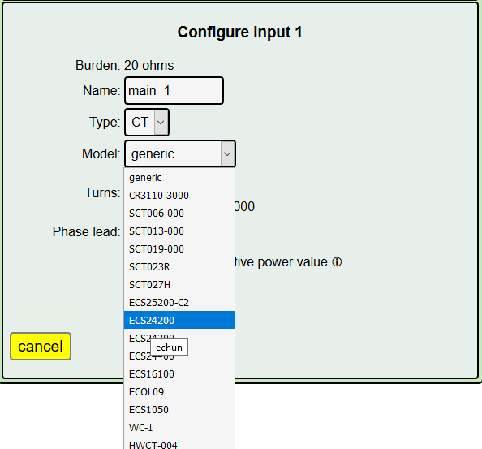
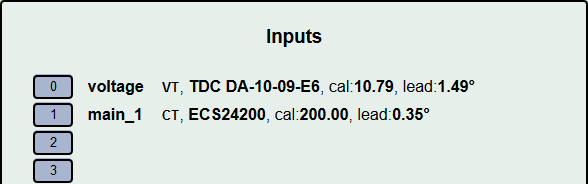

================================
Configuring Power Channels (CTs)
================================

What is a power channel?
------------------------

Power channels measure the current flow through a circuit and 
combine that with the reference voltage to determine power, 
expressed in watts, and to accumulate energy used, expressed in watt-hours.  
Current through a circuit is measured indirectly by installing a passive 
sensor, called a *current transformer* (CT), around one of the conductors 
in the circuit. 
CTs come in a various capacities, physical connection type, and electrical output.  

The good news is that IoTaWatt supports a wide variety of readily available 
CTs, and many can be configured simply by selecting the model from a list. 
CTs are connected with 3.5mm stereo jacks (headphone jacks). 
The CTs that are sold at the `IoTaWatt stuff store <http://stuff.iotawatt.com>`_  
are manufactured with 3.5mm jacks.  

.. figure:: pics/CTconfig/CT.jpg
    :scale: 20 %
    :alt: Echun ECS16-100

    Echun ECS16-100 CT

Connecting the CTs
------------------

This tutorial does not cover physical installation of the CTs to your 
electrical circuits. That should be done by someone familiar with 
electrical wiring. Your qualified installer will know how to do this. 
The 3.5mm connectors plug into any of the 14 input channels on the IotaWatt.

The only additional recommendation is that all of the CTs be oriented 
the same way with respect to current flow.  
Most CTs have an arrow or other marking to aid in consistent orientation. 
Not to worry, in the event some end up backward, IoTaWatt will still work, 
will tell you which ones appear to be backward, and provides a way to correct virtually.

You can find more detailed information about physical installation of CTs 
in the `CT Basics <CTbasics.html>`_ section.

Configuring the Input Channels
------------------------------

At this point, you should have the IoTaWatt up and running with the voltage 
channel connected, configured, and calibrated if necessary. 
You are using the config app in a browser connected to your WiFi network.  
Hover over |Setup| and click |inputs| in the dropdown buttons.

.. image:: pics/CTconfig/setupInputs.png
    :scale: 60 %
    :align: center
    :alt: Setup Inputs List

This screen should look familiar. We came here to configure the voltage 
transformer (VT). Now we will configure current transformers (CTs) to other 
inputs. To add or edit the CT specification for an input channel, 
click the channel's number button. Let's add a CT to channel |Input1|.

.. image:: pics/CTconfig/configGenericInput.png
    :scale: 60 %
    :align: center
    :alt: Config Generic CT

The app enters channel edit mode. Here you specify the model and other 
details about the CT connected to this particular channel.  
But first, it is helpful to name the channel by typing a name in the 
name box. You can just use the default "Input_1" or something more 
meaningful like "Kitchen" or "Living Room" or "Main". 
We will configure one of our US 120/240V split-phase mains
as **main_1**.

The default type is **CT** and that's correct.

The next drop-down box is the model of the CT.  
Initially it will be `generic`, 
Click the drop-down list and select the **ECS24200** CT.  

.. image:: pics/CTconfig/configECS24200.png
    :scale: 60 %
    :align: center
    :alt: Config ECS24200 CT

Notice that after selecting a specific device from the table, 
the input fields for "turns" and "phase" disappear.  
That's because those values are known for the listed CTs.  
If you have a CT that is not found in the list, 
you will need specify the "generic" entry and 
provide the turns-ratio and phase-lead for that CT.
see `generic CT`_ below.

There are check-boxes to further configure the CT.  
Most of the time, these will not be used, but there are circumstances 
where you would check one or more of them. If you hover on the **!** 
next to each, a brief description will appear. They are explained below:

**Allow negative power value**
    This is typically checked only for mains in an installation with 
    grid-tied solar (net-metering).  Checking this box tells IoTaWatt 
    that it is normal for current to flow backward through this circuit, 
    as when a PV system creates more power than you are using locally 
    and the balance is "exported" to the grid.  When you check this 
    box you are affirming that the CT is installed correctly and that 
    negative power should not be automatically "corrected" to positive.

**Double**
    In North American split-phase power systems (120V/240V), 
    all circuits are assumed to be 120V.  When this option is selected, 
    power will be computed using double the value of the
    reference voltage, or nominally 240V. 
    Use this for 240V circuits where one CT has been applied to one 
    of the conductors and there is no neutral (white) wire used by the 
    appliance. Typical circuits would be Water Heater, Water Pump, 
    Mini-Split Heat-Pump. There are other ways to monitor 
    240V circuits as well.

**Reverse**
    Sometimes a CT is installed backwards with respect to normal 
    current flow.  
    IoTaWatt will sense this and correct automatically in single-phase 
    power systems. It will correct the negative value automatically and 
    indicate so in the status display with a little ↺ symbol. Selecting 
    this option will virtually reverse the CT as if it were oriented 
    correctly, obviating the need to physically reverse it.
    Doing so can be safer and/or easier, especially with solid core CTs. 
    While merely convenient for single-phase systems, correct orientation 
    is a necessity in three-phase installations because the IoTaWatt 
    cannot automatically sense a reversed CT and correct for it.

Press |save| to finish.

That's it.  The screen returns to the complete list of inputs where you 
can add more channels or change the configuration of existing inputs. 
Each time you press save, the new configuration is sent to IoTaWatt 
and the changes take effect immediately. If the CTs are installed 
and connected, you will can see the power displayed in the 
Input Channel `Status screen <status.html>`_.

When you have configured all of the CTs connected to the IoTaWatt, 
basic configuration is complete.
Click the |Status| button to see the IoTaWatt in action.

The following additional information may provide guidance for more advanced installations.

Generic CT
----------

We just configured a *Current Type* CT that was of a model known to 
IoTaWatt. If your particular CT is not one of the dropdown models, 
you will need to describe the **generic** parameters. 
You will recall that this is the initial model designation for a 
CT when a new channel is added. Its also a drop-down choice when 
editing a CT channel. With this model selected, 
you must specify additional information depending on the type of CT:

Current Type CT
~~~~~~~~~~~~~~~

Current type CTs are the most common type of CT used with IoTaWatt and
all of the CTs available in the IoTaWatt *Stuff* Store are of this type. 
They are typically described by the ratio of the maximum primary current 
that they can measure and the corresponding secondary current 
that will be produced, as in 200A:50mA. For these CTs, 
you will be asked to specify the "Turns:".  
This is the ratio of primary current/secondary current.  
So that 100A:50mA described above would be 100/.050 = 2000 turns.

Voltage Type CT
~~~~~~~~~~~~~~~

Voltage type CTs are typically described with an output in volts (V) and  
have an internal burden resistor that causes them to produce an output 
voltage rather than current.  They are connected to a modified IoTaWatt 
input that has had the internal burden resistor removed and specified as zero 
in the device configuration burden menu.  IoTaWatt will ask for a **Cal** 
factor. This is the primary current in amps that corresponds to 1 volt 
of output from the CT. An example of this is the SCT013-050 from YHDC.  
It is marked 50A/1V, so the **Cal** is 50.  Simple enough.

Phase
~~~~~

Both of the generic CT types above will also provide a place to specify 
**Phase**. Representative samples of the CTs in the model list have been 
tested to determine a phase correction value to compensate for phase 
shift of the transformer. If you have a generic CT a rule of thumb 
would be to use 2.0 for a split core CT (one that snaps onto a wire), 
and 0.2 for solid core CTs (Basically a solid doughnut that you pass 
the conductor through).

Enable derived three-phase
--------------------------

This checkbox enables advanced features used to configure inputs in a 
three-phase power system. Refer to the 
section `Three Phase Power <threePhase.html>`_ for more information.

.. |Setup| image:: pics/SetupButton.png
    :scale: 60 %
    :alt: **Setup button**

.. |Inputs| image:: pics/CTconfig/InputsButton.png
    :scale: 60 %
    :alt: **Inputs button**

.. |save| image:: pics/SaveButton.png
    :scale: 60 %
    :alt: **Save**

.. |Status| image:: pics/StatusButton.png
    :scale: 60 %
    :alt: **Status button**
