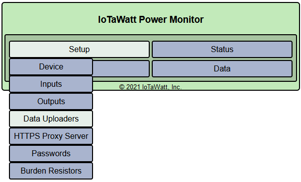
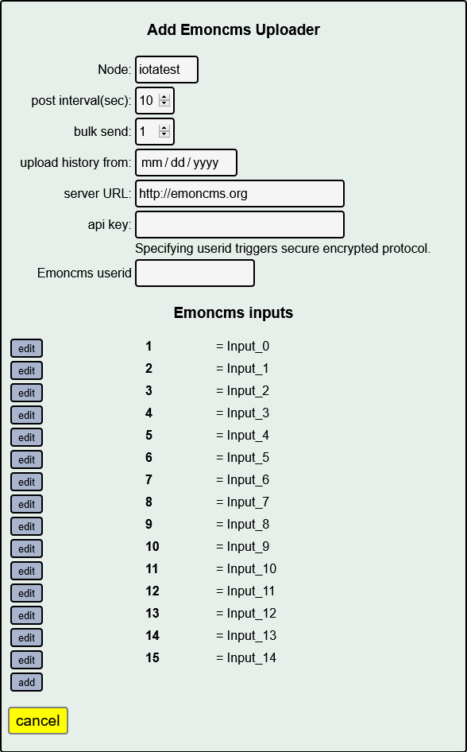
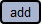

=======
Emoncms
=======

Setup Emoncms
-------------

Emoncms is an open-source system that stores time-series 
data and has multiple reporting apps developed by the authors 
as well as apps contributed by users in the open community. 
The graph application used locally by IoTaWatt is a derivitive
of that effort.

For a nominal fee you can use the managed
enterprise version of Emoncms at Emoncms.org or you can 
install the software on your own machine, including 
a RPi, and run a local instance for free.

Configuring an IoTaWatt to upload to Emoncms is easy. 
First, go to Emoncms.org and establish an account, or 
install the software on your server and setup an account. 
There is a nominal fee to use Emoncms.org that should amount 
to a few dollars per month for a typical IoTaWatt user.

Configure IoTaWatt
------------------

After establishing an account, run the IoTaWatt 
configuration application, hover over |Setup| and click 
|uploaders| from the dropdown menu.

Choose Emoncms.

.. image:: pics/emoncms/selectEmoncms.png
    :scale: 60 %
    :alt: **Select Emoncms**

Here you will specify the URL to use for emoncms, your credentials and
what data to upload.

**Node**
    Grouping that you want to assign to all data upload 
    from this IoTaWatt to distinguish it from data uploaded 
    from any other devices that you may have. 
    It is somewhat arbitrary and defaults to the name of 
    your IoTaWatt device.

**post interval**
    Number of seconds that each data point will represent. 
    The tradeoff is between higher resolution (small interval) 
    and minimizing the storage requirement of the data over 
    time (larger interval). IoTaWatt accepts any value 
    from 5 seconds to 3600 seconds (1 hour), in 5 second increments. 
    Because of the way Emoncms reports, it's best to use a number 
    that is an even factor or multiple of 
    one minute: 5, 10, 15, 20, 30, 60, 120, etc.

**bulk send**
    Number of interval postings to aggregate into a single 
    posting request. Specifying 1 will send a data packet 
    to Emoncms at each interval. 
    If your interval is 5 or 10, it will send a packet 
    every 5 or 10 seconds. That's fairly inefficient and 
    can be problematic when there are internet connectivity 
    issues. By specifying a larger bulk send, IoTaWatt will 
    aggregate the posting data for that many intervals and 
    send the data in one packet. 
    For instance if your interval is 10 seconds, 
    specifying bulk send = 3 will cause data to be sent 
    every 30 seconds. Large bulk send values will cause any 
    real-time dashboards in Emoncms to update less frequently, 
    so you should strike a balance. IoTaWatt keeps all of the 
    data in local storage, so there is no risk of losing data 
    by using this feature. Should there be any failure to deliver, 
    IoTaWatt will pick up with the last successful 
    posting when the problem resolves itself.

**upload history from**
    When starting a new Emoncms node, you can specify a date 
    from which to upload historical data. 
    To the extent that the data is available in the local datalog, 
    IoTaWatt will bulk upload the historical data to Emoncms. 
    The bulk upload can take anywhere from several minutes 
    to a day or more depending on the time-frame and the upload speed. 
    Regardless, the historical upload is done in the background 
    and will not significantly affect normal operation.

**server URL** 
    URL of the Emoncms server. This field defaults to the Emoncms.org
    server. The software is open, 
    so you may maintain your own server (software on GitHub) 
    or you may get one of the OpenEnergyMonitor.org products 
    that run a version of the software on a raspberry-pi. 
    When using a local instance of Emoncms, 
    you can use the IP format with optional port number. 
    An example might be http://192.168.0.112:80/emoncms.

    If you have setup a HTTPSproxy server, you can use the HTTPS://
    method here for secure uploads.  There is also a 

**api key**
    A 32 character hexadecimal key to authorize posting to an account. 
    Once you establish your account, 
    locate the read-write api key and copy/paste into this field.

**Emoncms userid**
    By specifying this optional value, you instruct IoTaWatt to use 
    a secure encrypted protocol to send data to Emoncms. 
    There is no downside to doing this, and it is recommended. 
    Your userid is a four or five digit number located 
    in the "My Account" section of the Emoncms.org site.

Now click |save| and IoTaWatt should begin sending data to 
your Emoncms account. You can see the status of the 
Emoncms service in the `Status Display <status.html#web-servers>`__

IoTaWatt uploads the current voltage or power corresponding 
to all of the input channels in each post. 
You can configure Emoncms (follow their instructions on the website) 
to save only what you want to keep in "feeds". 
Setting up and configuring the Emoncms account is 
documented on the Emoncms.org site.

Customizing Input data
----------------------

You can customize the data that is sent to Emoncms 
using the Emoncms Inputs list at the bottom of the 
configuration screen. This list is very similar to the 
Configure Outputs section, except rather than calculate 
named values that can be viewed in the status screen 
or displayed in the graph application, 
you specify how to calculate the individual inputs 
to Emoncms using the same calculator interface.

Initially, these fields correspond to each of the IoTaWatt inputs. 
By editing this list, you can change the values that are sent, 
delete specific values, or add additional computed values to be sent.

One distinctive feature of this list vs the outputs list is that the 
names must be numeric values between 1 and 99. 
The name of an entry corresponds to the Emoncms input "key" value. 
When editing the various fields, 
if you add a new entry with the same number as an existing entry, 
or change an entry to the same number as an existing entry, 
it will replace the existing entry. Each time you save an entry, 
the list will be reordered.

.. |save| image:: pics/SaveButton.png
    :scale: 50 %
    :alt: **Save**

