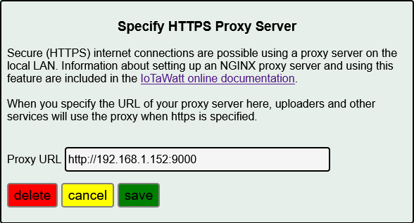

==================
HTTPS Proxy Server
==================

Like many IoT devices, IoTaWatt does not have the resources to communicate
over the internet using secure TLS. While the local LAN can be relatively secure,
data uploaded to internet based servers is transmitted in plaintext and
vulnerable.  One exception is the Emoncms web service where a protocol
to authenticate and encrypt communications is available.

Some external services, such as influxCloud, require TLS (HTTPS) be used
in all communications.  IoTaWatt can use a simple proxy server on the local
LAN to overcome this limitation and forward internet communications using HTTPS.

NGINX (engine-x) is an open-source web-server that can be hosted on a variety
of inexpensive processors.  The ubiquitous RaspberryPi being a simple and 
inexpensive favorite.  Once setup, you only need to set the URL of the 
proxy server into IoTaWatt, and it will be used to communicate with any
uploader where the URL of the service is specified as HTTPS:// method.

Setup up NGINX on a RPi
-------------------------

Rather than reinvent the wheel, this section will lean heavily on existing webtutorials to
setup a RPi based NGINX proxy.  Many will already have an RPi or other Linux based
resource on their LAN and can host NGINX there.

An RPi 3 Model B or better is recommended. With a case, SDcard and power supply the cost 
is usually less than $50 US. There are many tutorials for setting up the Basic RPi
with the latest software release.  Rather than post a link that may get stale, 
I'll leave it to the reader to search the internet for one that suits their
capabilities.

Once the basic system is up and running, it's easy to add NGINX.  Simply follow this tutorial_
from the RaspberryPi folks.

.. _tutorial: https://www.raspberrypi.org/documentation/remote-access/web-server/nginx.md

Add the HTTPSproxy location
------------------------------

Whether you decided to setup a RPi with NGINX or you installed NGINX on another platform,
all that is left is to add the Location configuration for the HTTPS proxy.

Download the HTTPSproxy location from the IoTaWatt
server to the NGINX configuration using the command:

    ``sudo wget -P /etc/nginx/sites-enabled https://iotawatt.com/download/HTTPSproxy``

Then reload the NGINX configuration using the command:

    ``sudo nginx -s reload``

Configure the proxy in IoTaWatt
-------------------------------

Using a fixed IP address for the NGINX host, setup it's address in IoTaWatt.
Select |setup| then |HTTPSproxyButton| from the dropdown.
Add the URL with port :9000 and press |save|.

.. |Setup| image:: pics/SetupButton.png
    :scale: 60 %
    :alt: **Setup button**

.. |save| image:: pics/SaveButton.png
    :scale: 60 %
    :alt: **Setup button**

Using the HTTPS proxy
---------------------

Once the HTTPS proxy address is specified, using it is easy.
PVoutput will automatically start to use HTTPS.
For influx or Emoncms uploaders, simply change the server
URL method to HTTPS://.

