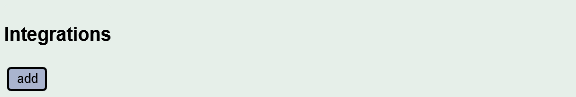

============
Integrations
============

What are integrations?
----------------------

The IoTaWatt datalog provides high speed access to all monotonic data derived 
directly from the datalog or indirectly with output Scripts.  That is to say, if
the total value only increases, or only decreases, everything works just fine.

The exception is where a CT is configured with "allow negative values" as with 
a mains CT where solar or other alternative energy sources can "export"
energy to the grid.  In those cases, the total energy represented is the net 
energy, not a monotonically increasing value.

The individual five-second data in the datalog is signed and will be a net
import (+) or export (-), but when the data is viewed in a broader context 
of hours, the net does not provide accurate import and export values.

What is needed is to add up those individual 5 second imports (positive values)
and exports (negative values), and to save them as monotonic values that can
be used in output Scripts.  That's what integrations do.

How they work
-------------

As previously mentioned, the detail data exists in the five-second current datalog.
When you create an integration, a small additional datalog is created to
contain the integrated value. The new datalog has the same name as the Integration. 

A background Service is created to begin processing the five-second datalog 
from the previous 24 hours. This takes about ten minutes. The Integration accumulates
the positive five-second values in the new datalog.

When the background process has processed the historical data, it is *synchronized*
with the current log.  At this point the Service terminates and the
datalog Service, which maintains the current log, takes on the task of updating
the Integration log as an atomic operation when writing new datalog entries.

Creating an Integration
-----------------------

Hover over |Setup| and click |Integrations| in the dropdown buttons.

This will list any integrations that you have already configured, 
and allow you to click |add| to create a new one.  
You can click |edit| on existing integrations to change or delete them.

From here, the process is identical to adding any other output.
For a refresher, see `Adding a new Output <outputs.rst>`_ 
Integrations must be uniquely named using alpha-numeric characters and the
underscore (_) character.

The Script that is specified will be integrated to sum the positive and negative components.

Using the data
--------------

Once the Integration is *synchronized*, it should remain so going forward.
When creating a new output Script, there will be three new selections
available in the inputs list.  They will all begin with the name of the
integration with these appendages:

  .net
    Returns the net value of the Integration script, just as it
    would if the script were used outside of an integration, except that
    the result will be based only on data within the time period defined
    by the Integration log.

  .pos
    Returns the sum of the positive five-second intervals within the requested period.

  .neg
    Returns the sum of the negative five-second intervals within the requested period.

Note that for any period,  .net = .pos + .neg

.. |Setup| image:: pics/SetupButton.png
    :scale: 60 %
    :alt: **Setup button**

.. |add| image:: pics/addButton.png
    :scale: 60 %
    :alt: **Add button**

.. |edit| image:: pics/editButton.png
    :scale: 70 %
    :alt: **edit button**

