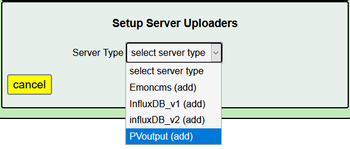
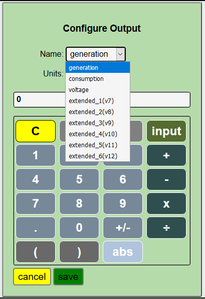

========
PVoutput
========

`PVOutput <https://pvoutput.org/about.html>`__ is a free service for sharing, 
comparing and monitoring live solar photovoltaic (PV) and 
energy consumption data. 
It is a worldwide catalog of installed PV sites containing details 
of location, output, capacity, and efficiency. Individually, 
you can maintain data about the production of one or more sites 
along with voltage and consumption data. 
There is also an ability to use the service to capture and report 
up to six additional data items with the ability to generate 
real-time alerts based on simple rules. IoTaWatt supports 
uploading in both the basic free mode and the extended donator mode.

.. image:: pics/PVoutput/PVoutputDisplay.png
    :scale: 60 %
    :align: center
    :alt: Sample PVoutput Display

But you don't need to have solar generation to use the service. 
You can use it to upload consumption and voltage, 
as well as six more data sets in donator mode. 
So lets look at how to set this up with IoTaWatt.

First, you should review the local time offset specified in your IoTaWatt. 
IoTaWatt synchronizes with PVoutput using local time, 
including daylight time where applicable. 
In the Setup/Device display of IoTaWatt, 
set the time offset for your local standard time, 
then if your locale observes daylight time (or summer time) 
check the Allow Daylight Time box.

Create a PVoutput Account
-------------------------

From your browser, follow the register link on the PVoutput.org login page 
or just click `here <https://pvoutput.org/register.jsp>`__. 
Enter a login ID, password, your email 
to setup an account, then go to the settings page. 
Go through the items and select what is appropriate for your locale 
in terms of date/time format, decimal characters etc. 
Pay particular attention to the timezone setting. 
Your account must match the local time setting of your IoTaWatt. 
Click Save at the bottom and your account is setup. 
Note that this page is where you will find your API Key, 
which is one of the few things you will need to specify in the IoTaWatt setup.

Add Your System
---------------

Click on the Add System link under Registered Systems at the 
bottom of the page. You really don't need to enter much here to get 
started. The System Name should be something meaningful to you, 
but if you want to allow your PV data to be public, 
you might consider using a something that is not personally identifying. 
If you have no solar, you can check the Energy Consumption Only box. 
If you have solar and you fill in the details about your setup, 
PVoutput will report your efficiency and be able to compare it to similar 
systems.

Under Live Settings, set the interval to 5 minutes and double 
check that the timezone matches what you have set in IoTaWatt. 
Click Save. Note the System ID. IoTaWatt will need to know that.

Configure IoTaWatt
------------------

It's time to configure IoTaWatt to upload to the new account. 
From within the IoTaWatt configuration app, 
click |setup| and then |uploaders| from the dropdown menu.

Select PVoutput.

Complete PVoutput setup.

.. image:: pics/PVoutput/PVoutputAdd.png
    :scale: 60 %
    :align: center
    :alt: PVoutput Add Service

Copy and paste the API Key and System Id from the PVoutput system page. 
For now, set *upload history from* to a recent date like yesterday. 
Do not check the *Reload History* box.

All that's left is to specify the data to upload. 
Under **Status Outputs**, click |add|.

As you can see, it's the standard calculator/script interface. 
The illustration shows the dropdown menu associated with the name. 
There are nine data items that can be uploaded. Of the nine, 
generation, consumption, and voltage are standard. 
The six *extended_1(v7)* through *extended_6(v12)* entries are 
additional data that can be uploaded in donation mode. 
At a minimum, you will need to configure either generation, 
consumption or both.

**generation** 
    Specify this if you have a solar PV system.
    Select the IoTaWatt input that measures your inverter output.
    
**consumption**
    This is the amount of power you use. 
    There are two general cases for this depending on where
    the solar power is introduced into your system.

    *   If the inverter feeds in before the mains breaker,
        then consumption is simply the value of your mains::
            (main_1 + main_2)
    *   If the inverter feeds in after the mains breaker,
        i.e. into a breaker inside your panel,
        then your consumption is the sum of the mains and the solar::
            (main_1 + main_2 + solar) max 0

**voltage**
    PVoutput will record and plot your voltage.
    Most users will simply use the channel_0 voltage input for this.

**extended_1(v7) - extended_6(v12)** 
    These are the extended values that you can record when you make a 
    donation to PVoutput. Some of the PVoutput documentation refers 
    to then as extended_1 through extended_6, 
    other places they are called v7 through v12. They are the same.

When all of the outputs are specified, click |save|. 
The PVoutput service will start and uploading will begin. 
You can monitor the progress in the PVoutput tab of the Status display.

Reload History
--------------

PVoutput allows reloading of historical data subject to lookback limits 
and maximum transaction rates. Once you are confident that your 
configuration is correct and uploading what you want, 
you can upload whatever historical data may be in your data logs. 
To do this, select the date that you want to begin from, 
and click the *Reload History* box. When you press |save|, the reload will begin.

If necessary, the starting date will be adjusted to coincide 
with the contents of the data log. Up to 14 days of history can be
uploaded in free mode while donator mode allows 90 days.

Large history uploads may pause due to hourly transaction limits 
imposed by PVoutput. 
The message log will indicate these pauses and when to expect resumption.

When the reload is complete, you must reset the reload 
history checkbox manually, or the data will reload after every restart.

.. |add| image:: pics/addButton.png
    :scale: 70 %
    :alt: **add button**

.. |save| image:: pics/SaveButton.png
    :scale: 50 %
    :alt: **Save**

.. |Setup| image:: pics/SetupButton.png
    :scale: 60 %
    :alt: **Setup button**

.. |uploaders| image:: pics/uploadersButton.png
    :scale: 60 %
    :alt: **Web Server**
