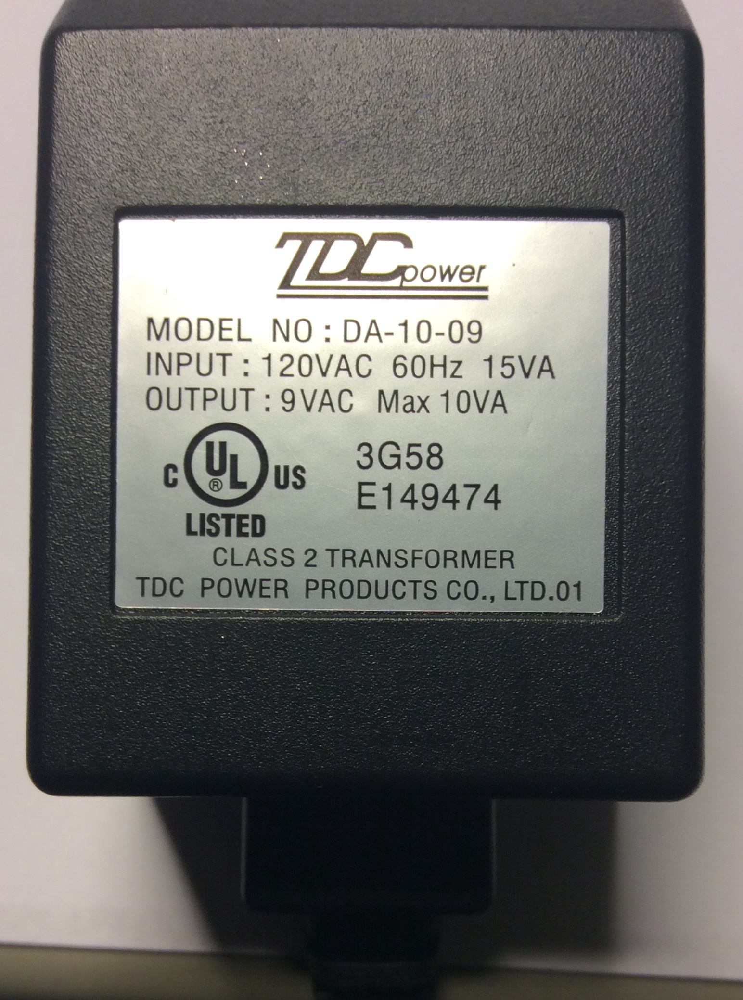
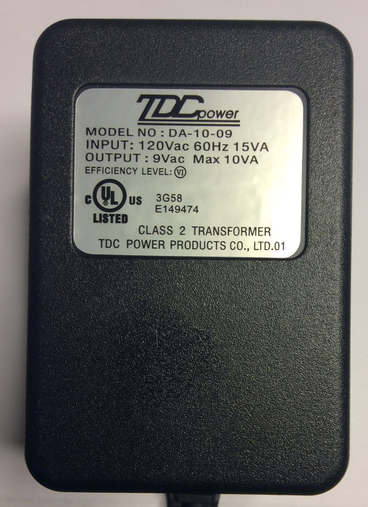
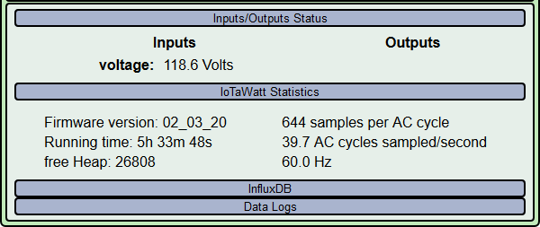
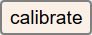

=================================
Voltage Transformer Configuration
=================================

A prime component of electrical power is voltage.
The AC line frequency is the heartbeat of the IoTaWatt.
A reliable and accurate AC voltage reference is very important.
You should have installed the device with a 9 Volt AC voltage reference
transformer (VT) plugged into the channel zero power jack.
If your initial configuration has this channel pre-configured,
your LED will be glowing green because it's rhythmically sampling that voltage.

Various transformer models produce different voltages,
and it's important to ensure that the VT specified 
matches the model that you have installed.
To do this, select the inputs button in the Setup dropdown menu.

.. image:: pics/VTconfig/VTinputList.png
    :scale: 60 %
    :align: center
    :alt: Setup Inputs List

A list of all of the inputs will be displayed.
The first entry will be input 0 and a default VT should be configured.
Check to see if it's the same as your VT model.
It's OK to unplug the VT to check the model number printed on it.

If your VT model doesn't match the model that is configured, you can easily change it.
Click on the input channel 0 button on the left.

.. image:: pics/VTconfig/VTconfig.png
    :scale: 60 %
    :align: center
    :alt: Configure VT Menu

As you can see, the display changes to reveal the details of the input_0 configuration.

.. image:: pics/VTconfig/VTselect.png
    :scale: 60 %
    :align: center
    :alt: Select VT Image

VT Model Selection
------------------
If your make and model is listed, select it from the list.
At this point, you can just click |save| and the standard 
calibration for your VT will be used.
That calibration should be good for all but the most discerning users.
If you have access to a good voltmeter or other reliable 
high accuracy voltage reference,
you can fine tune with the calibration procedure below, but for average users,
you should be good to go on to the next step Adding Power Channel CTs

If your VT wasn't listed in the dropdown above,
the generic entry is a reasonable starting point 
that will get you in the ball park for your 9-12Vac adapter.
If your country is 230V or 240V select "generic240V". 
Now you must perform the `Voltage Calibration`_  procedure below.

TDC DA-10-09 model ambiguity
~~~~~~~~~~~~~~~~~~~~~~~~~~~~

There are two different voltage transformers available with the model designation TDC DA-10-09.
These models are quite different and need to be properly configured.

    use model: TDC DA-10-09

    use model: TDC DA-10-09-E6

Voltage Calibration
-------------------

Again, if you are using one of the standard voltage transformers from
the tables, this step is optional. 
Repeated random tests on the standard US and
Euro transformers yield excellent calibration right out of the box.

You will need a halfway decent voltage reference for this step.
If you don't have a decent true RMS voltmeter and can't borrow one, 
go out and get a Kill-a-Watt.
They cost less than $20 (some libraries lend them out) and 
I've found their voltage readings are usually accurate.

click |calibrate|

.. image:: pics/VTconfig/VTcalibrate.png
    :scale: 60 %
    :align: center
    :alt: Calibrate VT Menu

Follow the instructions on the page. Increase or decrease the "cal" factor
until the voltage shown settles down and is a pretty 
good match with your reference meter.
It's not possible to match exactly. 0.2V in a 
120V installation is 0.2% variation.
A good meter accuracy is 1% at best. Just try to get the 
two to dwell around the same set of fractional digits.

As instructed on the page, click save to record the calibration factor.
The new calibration factor will take effect immediately.
Click the Status menu button to display the voltage:

Wait a few seconds then check that the voltage 
displayed is still in the ball park.
If not, repeat the calibration procedure.

Once calibration is complete and verified,
you will not need to do it again unless you change your VT transformer.
The IoTaWatt has a very accurate internal calibration reference and will maintain
its accuracy indefinitely. You should have no further need for the voltmeter.

Now the device is ready for the next 
step `Configuring Power Channel CTs <CTconfig.html>`_

.. |save| image:: pics/SaveButton.png
    :scale: 50 %
    :alt: **Save**

