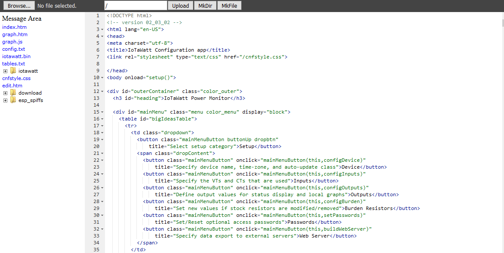

=======================
File Manager and Editor
=======================

IoTaWatt file systems
---------------------

IoTaWatt has two file systems. 
The primary file system is maintained on the internal SDcard 
and is formatted as FAT32. Typical SDcard size is 8Gb. 
All of the web server files as well as the 
data and message logs are maintained on the SDcard.

The ESP8266 also has an onboard file system called the 
SPI Flash File System or SPIFFS that is much smaller at 1Mb. 
IoTaWatt uses that area for limited device specific information. 
This file system uses a flat directory structure, however 
IoTaWatt presents it as hierarchical through the file manager.

File Manager
------------

The integrated web server can be used to access and manage 
the files on both the SDcard and in the SPIFFS file system. 
The web server is based on the generic ESPWebserver developed 
by the folks at the ESP8266/Arduino project. 
The file manager application is the unmodified application 
that they distribute. The major functions are:

*   Display file system
*   Delete files
*   Upload files to the IoTaWatt
*   Download files from the IoTaWatt
*   Edit files

The File Manager is accessed from the dropdown buttons in the 
Tools main menu.

The left column is the file list. 
Directories can be expanded by clicking the + sign 
as in the typical paradigm. Action can be taken on individual 
files by right clicking and selecting from the options:

*   Edit
*   Download
*   Delete - Proceed cautiously. 
    There is no confirmation popup. Delete is delete now!

Downloading Files
-----------------

To download a file, right-click it in the file manager as above
and select the Download option. Exactly how it is handled and
where the file is downloaded is a function of your operating
system and browser, but it will follow the normal protocol.

Uploading Files
---------------

Files can be uploaded to the IoTaWatt by clicking the 
Browse button at the top and selecting a file in the manner 
provided by your browser. Once selected, click Upload to transfer 
the file to the IoTaWatt file system. You can edit the 
pathname before uploading. 
Additional buttons are provided to create a new directory or file.

SPIFFS
------

The SPIFFS is presented as the directory esp_spiffs. 
Expanding that directory will reveal the contents of 
the SPIFFS with a pseudo hierarchical directory structure. 
Files can be accessed in the same way as on the SDcard.

ACE Editor
----------

One of the most powerful features of this app is the editor. 
It's a version of the open `Ace Editor <https://ace.c9.io/>`__ 
and is very fast and capable. 
It's not particularly useful on mobile devices, 
but does very well on a keyboard equipped browser. 
You will need to learn the keyboard shortcuts, 
but even with just a few of the usual suspects, you can be very 
productive (ctrl-S save, ctrl-Z undo, ctrl-F find, etc.)

The IoTaWatt configuration app was developed exclusively 
using this editor and an IoTaWatt. 
In fact, that's the file that appears in the editor 
window when you start the file manager app.

