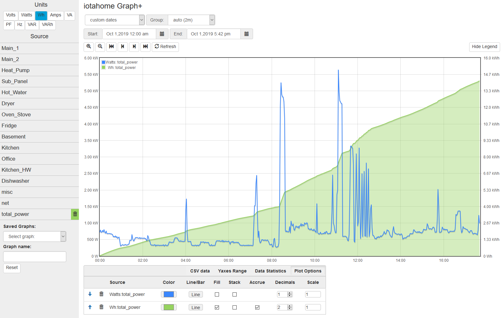
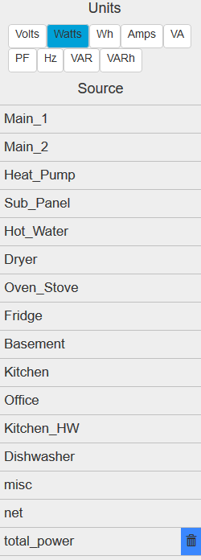
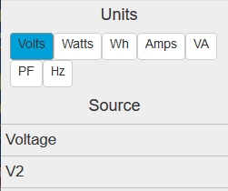
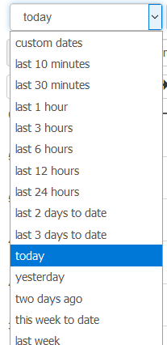
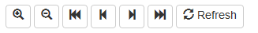
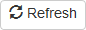
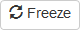
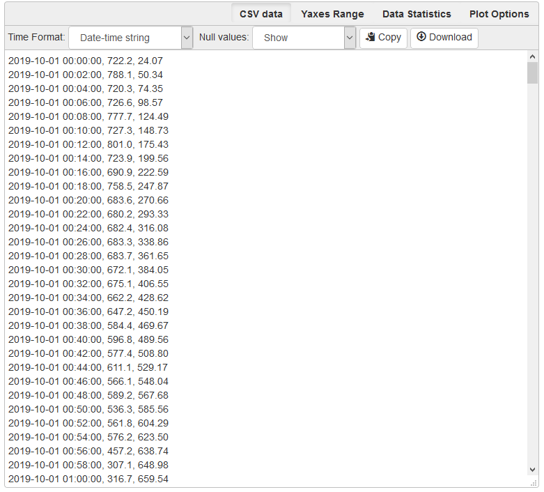
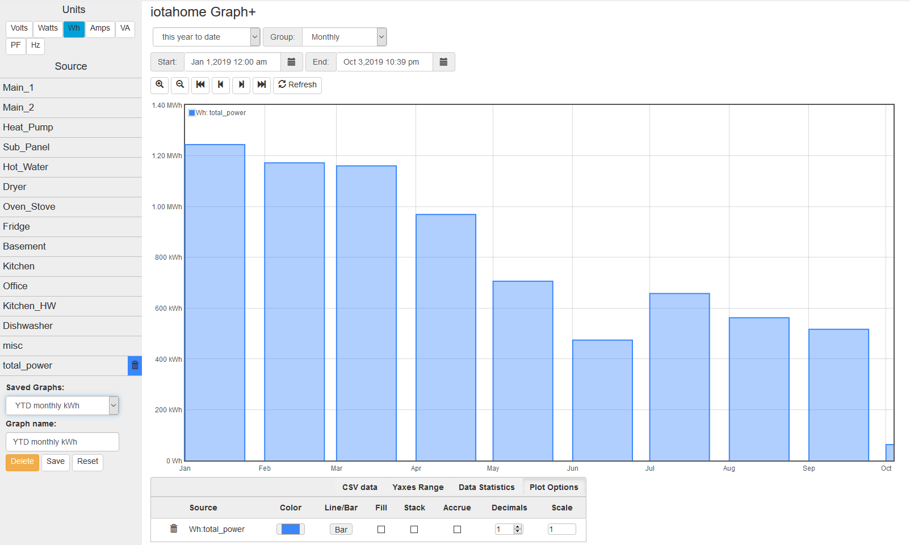

======
Graph+
======

Available with release 02_05_00.

This data visualization application runs in any browser to graphically present 
any of the data stored in the IoTaWatt. It features relative and absolute time period selection 
and handles all units of measure supported by IoTaWatt. You can produce line and/or bar charts 
with optional stacking and fill. Real-time graphs can be set to automatically refresh.  
Once created, any graph specification can be saved for quick future use.

The application is fully adaptive so it will work well on a full range of 
devices from mobile to desktop.  

The window can be broken down into four parts, each serving a different function:

* `Unit/Source selector`_
* `Time period selector`_
* `Graph window`_
* `Trace tables and options`_

Below is a complete window with all of the parts. 
We're plotting power for the current day
(midnight to 5:42pm).  Along with that we've plotted the accrued Watt-hours for the day, 
14.2 kWh as of 5:42.

Unit/Source selector
--------------------

So now lets break it down.  On the left is the "sidebar" where you select each of the 
measurements that you want to plot.
Every input (or output) can produce a variety of measurements.  
VTs measure Voltage and frequency(Hz), and CTs measure Watts, Watt-hours, Amps, VA,
and Power-Factor (PF).  So the first thing is to select the measurement you are interested in.
At the top are the unit selection buttons. Click on the particular unit you are interested in.

The Source list that appears below the unit selection will list all of the sources 
that can produce a measurement with the selected until.  
Basically Volts and Hz pertain to VT inputs and all other units pertain to inputs 
(or outputs) that are configured with CTs. 
The list will change immediately when a new unit is selected. 

On the right Watts are selected and this IoTaWatt lists 15 sources that are configured 
as power channels (CT inputs or CT based outputs). Note that the last entry shows a 
blue trash-can indicating that particular unit/source has been selected and is 
currently graphed.

To the left Volts are selected, so a different set of data sources corresponding to voltage
inputs (VTs) are listed.

Click on any of the individual sources in the list to add that data source to the graph, 
measured in the selected unit.  This combination is called a trace.  It will be assigned 
a distinguishing color and the list entry will now include a trash-can symbol with the 
assigned color as a background.  The trace should also appear on the graph within several seconds.  

While the list of sources may be the same for different units like Watts and Wh,
they only show active if they are being graphed in the currently selected unit.
In the case of the graph above, Total-Power is plotted as both Watts and Wh, so it
will appear as selected under both units, but note in the large picture above 
that the color is blue under the Watts unit, while it is green under the Wh units, 
indicating they are different traces.

One final note about the sidebar.  It will disappear when the screen size gets to be 
too narrow to accomodate it.  When that happens, it is replaced by a list icon at the 
top left of the main screen.  Pressing that will overlay the main body with the selection 
sidebar. An X on the sidebar is used to hide it again.

Time period selector  
-------------------------

Graph+ plots all selected traces over a single time period that is defined
and modified using the time period selection section. 
You can select one of the many pre-defined
relative time periods or specify absolute dates and times.
Once data has been plotted, the zoom/pan buttons can be used to modify the 
time-frame.  Graphs with relative time-periods ending in the present can be set to 
automatically refresh.

.. image:: pics/graphPlus/timeSelector.png
    :scale: 80%
    :align: center
    :alt: Time timeSelector

Period Selector
...............

This is where you specify an initial time period, and where you go to change it.
In the upper left is a dropdown selector that is used to specify common relative 
time periods.

For most analysis of recent activity, these selections should make things
quick and easy.  All of these predefined periods are relative to the current date/time.
So if you ask for today, you will get a plot of measurements from midnight to the 
current time.

Group Selector 
..............

IoTaWatt records each measurement at 5 second intervals. That's 17,280
measurements per day. The graph size cannot possibly represent that, and it would take
a long time to query that amount of data.  Instead, IoTaWatt can deliver either
the average value or net change of a measurement for any given interval.
So when plotting a day's worth of data, we ask for automatic grouping which results
in aggregating the data over 2 minutes in a 24 hour period.  If you were looking at
one hour or less, the grouping would be the highest resolution 5 seconds.

There are other choices when looking at longer time periods. Here we're plotting last month's 
usage and will group by day.  This will return the average or change in value for each of
the 28-31 days in the past month.  All units are averaged except Wh, which return the
total used in each grouping.  So in this case, there would be 28-31 data points plotted.

.. image:: pics/graphPlus/groupSelect.png
    :scale: 80%
    :align: center
    :alt: Group Selecting

It's important to note that when selecting grouping by day, week, month or year, you are
not just getting the nominal grouping of 24 hours, 168 hours, etc.  The selection process
recognizes daylight-time in determining hours and days, and recognizes day of week,
and month boundaries.

*   Weeks begin and end at 12:00am on Sunday.
*   Months begin and end at 12:00am on the 1st day of the month.
*   Years begin and end at 12:00am on Jan 1.

Custom Date Selection 
.....................

If the time period needed isn't covered in the selection list above, there are 
date pickers that can be used to choose specific start and end dates (and times).
If you click on these dates, a calendar will appear to select a start and/or 
end date and time.  When you change either of these dates, the period selector 
will automatically change to "custom dates" and the graph will be updated to span
the new date specification.

This is only one of several ways to manipulate custom dates. There are two other
ways to modify the dates bounding the current graph.  The most obvious is the 
zoom/scroll bar.

This bar works just as you think.

* Zoom (+) will zoom in 50% on the center of the graph.
* Zoom (-) will zoom out 100% on the center of the graph.
* Left Full (<<) Will shift the time into the past 100%, ending where it once began.
* Left Half (<) Will shift the time 50% into the past.
* Right Half (>) Will shift the time 50% into the future.
* Right Full (>>) Will shift the time 100% into the future, starting where it once ended.

There is one last way to modify graph period.  You can simply select a subset of 
the graph window holding down the left mouse button.  When you release it, the 
highlighted selection will become the new time period.

.. image:: pics/graphPlus/screenSelect.png
    :scale: 40%
    :align: center
    :alt: Screen Selection

Refresh/Freeze
..............

The |refreshImage| button will immediately refresh the current plot.
If the time period of the current plot ends at the current time, 
as in the "Today", "Last 10 minutes", etc., the display 
will continue to refresh at the "interval" rate.  
For example if the auto interval is 2 minutes, it will continually refresh every 2 minutes.
You will know it is auto refresh mode because the Refresh button will change to
|freezeImage|. If you click this button the auto refresh will stop and the button will
revert to the manual |refreshImage| button.

The Refresh/Freeze state is retained when saving and subsequently restoring graphs.
This feature is useful when loading a saved graph as an embeded window where there are
no controls, allowing an auto refresh graph can be displayed in a frame.

Graph window
-------------

Once data sources are selected, the graph window comes to life.

.. image:: pics/graphPlus/graphWindow.png
    :scale: 40%
    :align: center
    :alt: Graph Window

In the upper left is the legend, a list of all of the unit/source combinations that are 
being plotted. The color of each trace matches the color used to designate 
the source selection and the color associated with the trace in the option table that
will be described later.

There is no notion of a left or right Y-axis selection.  
Each unit that is included in the plot is alternately placed on the left and right side 
of the plot automatically. 
You know which scale pertains to each trace because the scales contain the unit designation.  

Trace tables and options
------------------------

The last major section of the window is the options and information table area.  This is a 
multi-purpose area that displays different tables depending on the selection in the 
top row. There are four tables:

Options Table 
.............

.. image:: pics/graphPlus/optionsTable.png
    :scale: 80%
    :align: center
    :alt: Options Table

This table lists all of the traces selected for the current graph, and allows 
modifying the default settings for each trace.  Changing an option will have
an immediate effect on the graph.  There is no Save or Refresh required.

:Arrows:
  These sort arrows appear when there are two or more entries in the table.
  Use them to reorder the entries.  Primarily helpful when using Stacked traces.

:Trash: 
  Removes the trace from the graph and deselects from the source list.

:Color: 
  Selects an overide color.

:Line/Bar:
  Toggle between line or bar chart for this trace.

:Fill:
  Fill the area under the line or bar.

:Stack:
  Stack this trace above any other stacked traces appearing
  before it in this list.  You can change the position of a 
  trace (and so it's stack position) using the sort arrows 
  appearing at the beginning of each entry when two or more 
  traces are present.

:Accrue:
  This checkbox will appear on Wh traces and causes the Watt-hours
  to accrue in order to plot a running total.  Wh are accrued in the sample
  graph to illustrate this feature.

:Decimals:
  The number of decimal places to request and plot.  The default
  value is typically appropriate for the unit of measure, but 
  sometimes increasing the precision provides a more detailed representation.

:Scale:
  The values returned in the query will be muliplied by this scale factor.
  This will affect the values in the CSV table as well.

Statistics Table 
................

.. image:: pics/graphPlus/statsTable.png
    :scale: 80%
    :align: center
    :alt: Statistics Table

This is a list the traces with useful statistics.

:Arrows:
  These sort arrows appear when there are two or more entries in the table.
  Use them to reorder the entries.  Primarily helpful when using Stacked traces.

:Trash: 
  Removes the trace from the graph and deselects from the source list.

:Quality:
  This indicates the number and percent of groups for which data was 
  available.  It is typically 100%, but could be less because of power 
  failures or malfunction during the period.  

:Min:
  The smallest group value graphed for this trace.

:Max:
   The largest group value graphed for this trace.

:Diff:
  Difference between Min and Max.

:Average:
  Mean value of all of the groups graphed for this trace. 
  Does not include null values.

:Sum:
    For Watt and Wh traces this is the total Wh for the period.

Yaxes Range Table 
.................

.. image:: pics/graphPlus/yaxesTable.png
    :scale: 80%
    :align: center
    :alt: Yaxes Range Table

This list is used to modify the Yaxis range for each unit.  The default is "auto",
which works well to represent the full range of the data, however the Min and/or Max 
can be specified here to overide the auto default.  Once changed, the new limit will remain 
in effect until one of these things happens:

* The overide value is removed.
* A saved graph is loaded.
* The reset button is clicked.

Plot Range:
  The Yaxis range used in the current graph.

Data Range:
    The actual range of all of the traces using this unit.

Min:
    The lower bound to be used in subsequent graphs, or blank for auto assignment.

Max:
    The upper bound to be used in subsequent graphs, or blank for auto assignment.

CSV Data 
........

This is a comma-separated-values listing of all of the data used in the current graph.
The first column is the time, subsequent columns are the group values for the
traces in the order that they are listed in the options or statistics tables.

There are a couple of options available:

Time Format:
    * Date-time string - selects a date and time format acceptable to spreadsheets.
    * Seconds-from-start - selects a count of seconds from the start time.
    * Unix-time - selects the count of seconds from Jan 1, 1970 UTC.

Null Values:
    * Show - include missing or invalid lines with "null" as a value.
    * Remove line - Where a line has a null value, remove the entire line from the display.

Copy:
    Copy the contents of the CSV table to the clipboard.

Download:
    Download the CSV data as a file.
    
Saving Graphs
--------------

Graph+ is great for ad-hoc queries, but it can take some time to fine-tune a 
busy graph, and it recreating it weekly or monthly can get old.  This is where 
the ability to save a set of graph specification comes in handy.

At the bottom of the sidebar you can save and reload any number of graphs.
Each graph is saved in the IoTaWatt, so it doesn't matter if you use a different 
browser or device to recall them, they will always be there.

.. image:: pics/graphPlus/savedGraphList.png
    :scale: 60%
    :align: center
    :alt: Saved Graphs

Once you have a graph that you like, enter a description in the *Graph name:* box. 
The **save** button will appear.  Click it. The graph has been saved. Click the 
*Saved Graphs:* selector and a list of all of the saved graphs will appear.
Click any selection and Graph+ will load that graph specification.

This is a graph of total monthly kWh to date.  Once loaded, I can do a lot with it:

* Change group to Weekly to see it by week.
* Change the period to last-year or anything else.
* Show the CSV table to see list of usage by month.
* Add traces for particular circuits, stacking if appropriate, to see a breakdown.
* Move the data to a spreadsheet to apply your tariff and convert to cost.

Note that you are saving the graph *specification*, not the actual graph.  If you
save a graph of yesterday and reload it tomorrow, it will plot today. If you want to
save a static graph, select the *custom dates* period at the top before saving.

Whenever a saved graph name is in the *Graph name:* box, the **Delete** key will be 
available. To change a graph specification, simply load it, make the changes and save 
it again.

Running Directly with URL
-------------------------

Graph+ can be loaded directly from the IoTaWatt's web server using the URL

http://iotawatt.local/graph2.htm [?graph=savedgraph [&embed] ]

Substitute your local hostname/IP address if different.

graph=
......

Optional query parameter to specify a saved graph that is to be loaded initially.

embed
......

Causes Graph+ to display only the plot window of the selected graph. 
If the saved graph has refresh enabled, the plot will refresh at the 
active interval.

Reset
-----
Sometimes you just want to start over with a clean slate like the app was just loaded.

