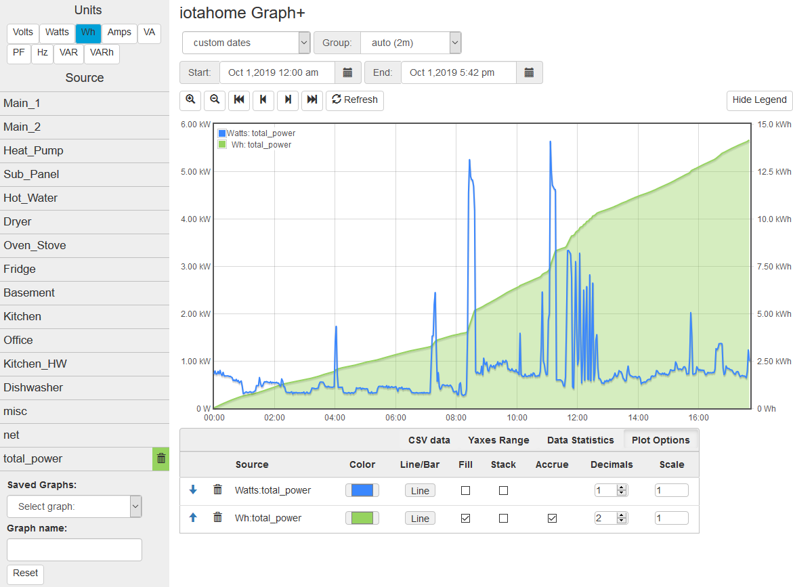
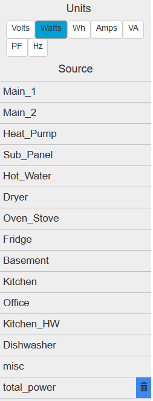
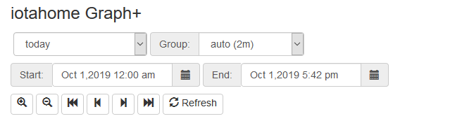
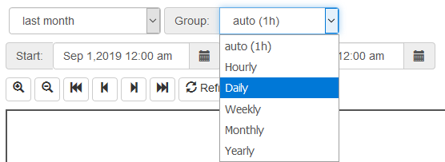
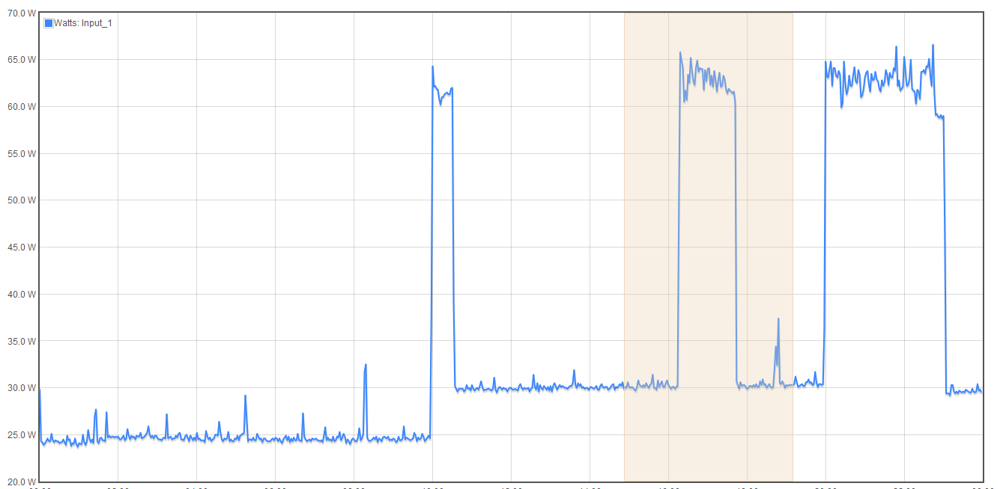
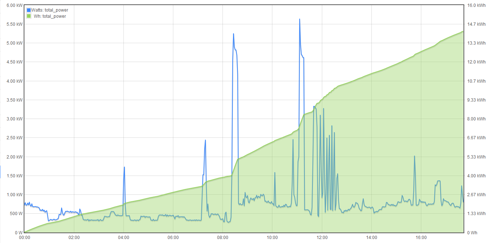
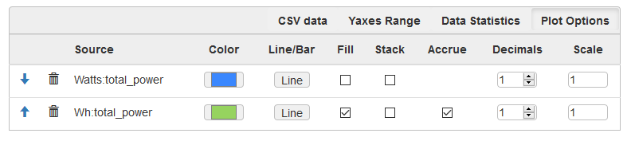
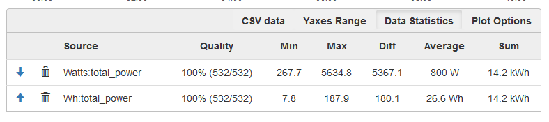
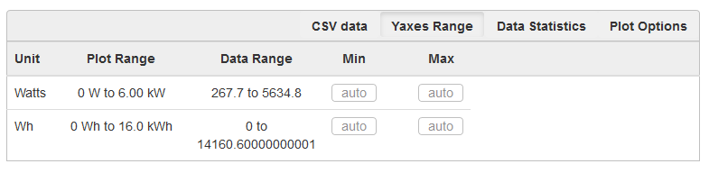
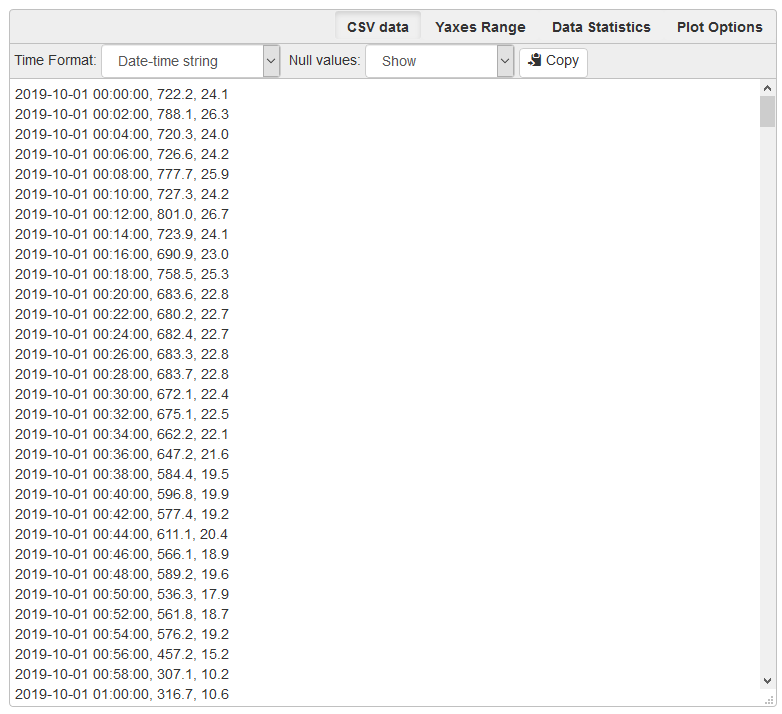

======
Graph+
======

Available with release 02_05_00.

This data visualization application runs in any browser to query and graphically present 
all of the data stored in the IoTaWatt. It features relative and absolute time periods, 
all units of measure supported by IoTaWatt and line and/or bar charts with optional stacking
and fill. Real-time graphs can be set to automatically refresh.  Once created, anygraph can be
saved for quick future use.

The application is fully adaptive using bootstrap 3 so it will work well on a full range of 
devices from mobile to desktop.  

The application can be broken down into four parts, each with a different function.  
First, here's the whole picture with all of the parts.  We're plotting power for the current day
(midnight to 5:42pm).  Along with that we've plotted the accrued Watt-hours for the day 
which are at 145.2 kWh as of 5:42.

Selecting the Source
--------------------

So now lets break it down.  On the left is the "sidebar" where you select each of the 
measurements that you want to plot.  
At the top is the unit selection. Click on the particular unit you are interested in.

The Source list that appears below will list all of the sources 
that can be represented with that measurement.  
Basically Volts and Hz pertain to VT inputs and all other units pertain to inputs 
(or outputs) that are configured with CTs. 
The list will change immediately when a new unit is selected. 
On the right Watts are selected and this IoTaWatt lists 15 sources that are configured 
as power channels (CT inputs or CT based outputs). Note that the last entry shows a 
blue trash-can. That indicates that particular unit/source has been selected and is 
currently graphed.

.. image:: pics/graphPlus/voltageSource.PNG
    :scale: 40 %
    :align: left
    :alt: VT sources

To the left Volts are selected, so a different set of data sources corresponding to voltage
(VT) inputs.

Once the unit is selected, click on any of the individual sources listed below to 
include in the graph.  When a source is selected, it will be immediately included
in the graph, and will be marked with a delete symbol the same color as assigned to 
it's graph trace.  Simply clicking the trash-can, or anyplace in the row actually,
will remove that source from the graph.

While the list of sources may be the same for different units like Watts and Wh,
they only show active if they are being graphed in the currently selected unit.
In the case of the graph above, Total-Power is plotted as both Watts and Wh, so it
will appear as selected under both units, but note that the color is blue under the 
Watts unit, while it is green under the Wh units in the large picture above.

One final note about the sidebar.  It will disappear when the screen size gets to be 
too narrow to accomodate it.  When that happens, it is replaced by a list icon at the 
top left of the main screen.  Pressing that will overlay the main body with the selection 
sidebar, and an X on the sidebar is used to hide it again.

Selecting the time period 
-------------------------

The time period section is the upper section of the main body. IoTaWatt is a time series 
datastore, and as such is the independent variable in all graphs.

Period Selector
...............

This is where you specify an initial time period, and where you go to change it.
In the upper left is a dropdown selector that is used to specify common relative 
time periods.

.. image:: pics/graphPlus/periodList.PNG
    :scale: 80%
    :align: center
    :alt: Period list

For most analysis of recent activity, these selections should make things
quick and easy.  All of these predefined periods are relative to the current date/time.
So if you ask for today, you will get a plot of measurements from midnight to the 
current time.

Group Selector 
..............

IoTaWatt records each measurement at 5 second intervals. That's 17,280
measurements per day. The graph size cannot possibly represent that, andit would take
a long time to query that amount of data.  Instead, IoTaWatt can deliver either
the average value or net change of a measurement for any given interval.
So when plotting a day's worth of data, we ask for automatic grouping which results
in aggregating the data over 2 minutes in a 24 hour period.  If you were looking at
one hour or less, the grouping would be the highest resolution 5 seconds.

There are other choices when looking at longer time periods. Here we're plotting last month's 
usage and will group by day.  This will return the average or change in value for each of
the 28-31 days in the past month.  All units are averaged except Wh, which return the
total used in each grouping.  So in this case, there would be 28-31 data points plotted.

It's important to note that when selecting grouping by day, week, month or year, you are
not just getting the nominal grouping of 24 hours, 168 hours, etc.  The selection process
recognizes daylight-time in determining hours and days, and recognizes day of week,
and month boundaries.

*   Weeks begin and end at 12:00am on Sunday.
*   Months begin and end at 12:00am on the 1st day of the month.
*   Years begin and end at 12:00am on Jan 1.

Custom Date Selection 
.....................

If the time period needed isn't covered in the selection list above, there are 
date pickers that can be used to choose specific start and end dates (and times).
If you click on these dates, a calendar will appear to select a start and/or 
end date and time.  When you change either of these dates, the period selector 
will automatically change to "custom dates" and the graph will be updated to span
the new date specification.

This is only one of several ways to manipulate custom dates. There are two other
ways to modify the dates bounding the current graph.  The most obvious is the 
zoom/scroll bar.

.. image:: pics/graphPlus/zoomScroll.PNG
    :scale: 120%
    :align: center
    :alt: Zoom/Scroll bar

This bar works just as you think.

* Zoom (+) will zoom in 50% on the center of the graph.
* Zoom (-) will zoom out 100% on the center of the graph.
* Left Full (<<) Will shift the time into the past 100%, ending where it once began.
* Left Half (<) Will shift the time 50% into the past.
* Right Half (>) Will shift the time 50% into the future.
* Right Full (>>) Will shift the time 100% into the future, starting where it once ended.

There is one last way to modify graph period.  You can simply select a subset of 
the graph window holding down the left mouse button.  When you release it, the 
highlighted selection will become the new time period.

The Graph 
---------

Once data sources are selected, the graph window comes to life.

In the upper left is the legend, a list of all of the unit/source combinations that are 
being plotted, and the color of each trace that matches the color used to designate 
the source selection, and the color associated with the trace in the option table that
will be described later.

There is no notion of a left or right Y-axis.  Each unit that is included in the plot 
is alternately placed on the left and right side of the plot.  You know which scale 
pertains to each trace because the scales contain the unit designation.  You will see
later how to change the boundaries of each unit scale.

Graph tables and options
------------------------

The last major section of the window is the options and information table area.  This is a 
multi-purpose area that displays different tables depending on the selection in the 
top row. There are four tables:

Options Table 
.............

This table lists all of the traces selected for the current graph, and allows 
modifying the default settings for each trace.  Changing an option will have
an immediate effect on the graph.  There is no Save or Refresh required.

:Arrows:
  These sort arrows appear when there are two or more entries in the table.
  Use them to reorder the entries.  Primarily helpful when using Stacked traces.

:Trash: 
  Removes the trace from the graph and deselects from the source list.

:Color: 
  Selects an overide color.

:Line/Bar:
  Toggle between line or bar chart for this trace.

:Fill:
  Fill the area under the line or bar.

:Stack:
  Stack this trace above any other stacked traces appearing
  before it in this list.  You can change the position of a 
  trace (and so it's stack position) using the sort arrows 
  appearing at the beginning of each entry when two or more 
  traces are present.

:Accrue:
  This checkbox will appear on Wh traces and causes the Watt-hours
  to accrue to plot a running total.  Wh are accrued in the sample
  graph to illustrate this feature.

:Decimals:
  The number of decimal places to request and plot.  The default
  value is typically appropriate for the unit of measure, but 
  sometimes increasing the precision provides a more detailed representation.

:Scale:
  The values returned in the query will be muliplied by this scale factor.
  This will affect the values reported in the CSV table as well.

Statistics Table 
................

This is a list the traces with useful statistics.

:Arrows:
  These sort arrows appear when there are two or more entries in the table.
  Use them to reorder the entries.  Primarily helpful when using Stacked traces.

:Trash: 
  Removes the trace from the graph and deselects from the source list.

:Quality:
  This indicates the number and percent of groups that for which data was 
  available.  It is typically 100%, but could be less because of power 
  failures or malfunction during the period.  

:Min:
  The smallest group value graphed for this trace.

:Max:
   The largest group value graphed for this trace.

:Diff:
  Difference between Min and Max above.

:Average:
  Mean value of all of the groups graphed for this trace. 
  Does not include null values.

:Sum:
    For Watt and Wh traces this is the total Wh for the period.

Yaxes Range Table 
.................

This list is used to modify the Yaxis range for each unit.  The default is "auto",
which works well to represent the full range of the data. The Min and Max can be
specified or changed to a specific value.  Once changed, the new limit will remain 
in effect until one of these things happens:

* The overide value is removed.
* A saved graph is loaded.
* The reset button is clicked.

Plot Range:
  The Yaxis range on the current graph.

Data Range:
    The actual range of all of the data using this unit.

Min:
    The lower bound to be used in subsequent graphs, or blank for auto assignment.

Max:
    The upper bound to be used in subsequent graphs, or blank for auto assignment.

CSV Data 
........

This is a comma-separated-values listing of all of the data used in the current graph.
The first column is the time, subsequent columns are the data group values for the
traces in the order that they are listed in the options or statistics tables.

There are a couple of options available:

Time Format:
    * Date-time string - selects a date and time format acceptable to spreadsheets.
    * Seconds-from-start - selects a count of seconds from the start time.
    * Unix-time - selects the count of seconds from Jan 1, 1970 UTC.

Null Values:
    * Show - include missing or invalid lines with "null" as a value.
    * Remove line - Where a line has a null value, remove the entire line from the display.

Copy:
    This button will copy the entire contents of the CSV table to the clipboard.
    

