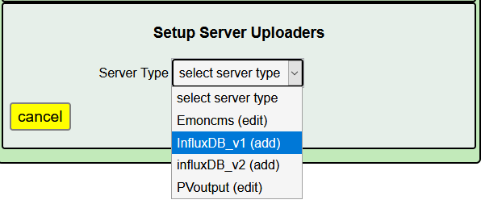
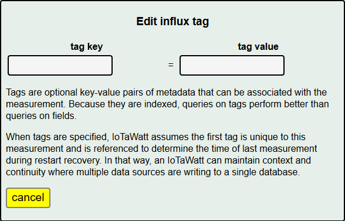
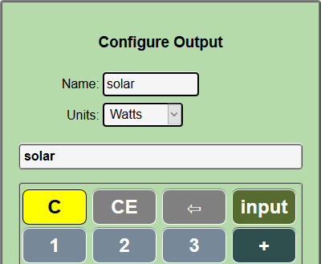

========
influxDB
========

influxDB is a fast open-source time-series database package. 
It can run on a variety of platforms and is also available 
as a managed, fully hosted service, from several vendors. 
As part of their "TICK" stack, InfluxData provides tools to 
facilitate collecting data from a variety of sources, 
as well as tools for infrastructure monitoring, 
alert management, data visualization, and database management. 
The popular grafana visualization tools also work well with influxDB.

IoTaWatt fully supports the influxDB HTTP API for uploading data 
to influxDB at a specific interval of 5 seconds to one hour. 
Like other similar IoTaWatt services, continuity of updates is 
maintained despite outages that may interrupt the communications.

This tutorial assumes you have established your own instance of influxDB 
or subscribed to a hosted service. It does not attempt to explain 
how to install or use influx or any of the related visualization tools. 
There's a whole universe of enthusiastic users at the influxData forum,
where you can get help with anything and everything.

influxDB versions 1.x and 2.x
-----------------------------

With the introduction of  nfluxDB 2.0
the basic measurement scheme remains the same, but there are significant changes:

- Authentication is changed from the basic userID/password of 1.x to 
  use of an 88 character base64 token.
- Where version 1.x organizes into a `database`, version 2
  introduces the concept of `buckets`.
- The native query in version 2 uses a new `flux` language as
  opposed to the `influxQuery` language in version 1.x.

There are various compatibility options available for transition fromversion 1.x
to version 2, depending on the implementation (cloud or OSS), but IoTaWatt
now supports both versions natively.

The two are similar enough that they will be covered together here with 
breakouts where needed to address the differences.

Configure influxDB uploader
---------------------------

To configure the influxDB upload service in IoTaWatt, 
Hover over |Setup| and click 
|uploadersButton| from the dropdown menu.

.. image:: pics/selectUploaders.png
    :scale: 60 %
    :align: center
    :alt: **Setup Menu**

Choose the appropriate version of influxDB...

Depending on the version that you selected, you will get one of two
similar setup menus.

.. image:: pics/influxdb/v1Setup.png
    :scale: 48 %
    :alt: **Version 1 Setup**

.. image:: pics/influxdb/v2Setup.png
    :scale: 48 %
    :alt: **Version 2 Setup**

**post interval**
    Number of seconds that each data point will represent. 
    The trade-off is between higher resolution (small interval) and 
    minimizing the storage requirement of the data over time (larger interval). 
    IoTaWatt accepts any value from 5 seconds to 3600 seconds (1 hour), 
    in 5 second increments. Although not a strict requirement, 
    it's best to use a number that is an even factor or 
    multiple of one minute: 5, 10, 15, 20, 30, 60, 120, etc.

**bulk send**
    Number of interval postings to aggregate into a single HTTP request. 
    Specifying 1 will send a data packet to influxDB at each interval. 
    If your interval is 5 or 10, it will send a packet every 5 or 10 seconds. 
    That's fairly inefficient and can be problematic when there are internet 
    connectivity issues. By specifying a larger bulk send, 
    IoTaWatt will aggregate the posting data for the specified number 
    of intervals and send the data in one packet. 
    For instance if your interval is 10 seconds, 
    specifying bulk send = 6 will cause data to be sent every 60 seconds. 
    Large bulk send values will cause any real-time dashboards to update 
    less frequently, so you should strike a balance. 
    IoTaWatt keeps all of the data in the SD data log, 
    so there is no risk of losing data by using this feature. 
    Should there be any failure to deliver, 
    IoTaWatt will pick up with the last successful posting when the problem is resolved.

**server URL**
    URL of the influxDB server. If the URL begins with HTTPS:// you must have
    specified a HTTPSproxy_ server.
    The url may contain a domain name or an IP address. 
    The *:port number* is optional and defaults to the influxDB port 8086 for version 1.

    .. _HTTPSproxy HTTPSproxy.rst
    
**upload history from**
    Specify the starting date that IoTaWatt will use to upload history 
    to a new set of measurements. When the influxDBService starts, 
    a query is made to determine the date/time of the last data written, 
    qualified by the first tag-set. Data upload is initiated as follows:

    ============================ ============================================== ========================
    Condition                    begin date specified                           begin date not specified
    ============================ ============================================== ========================
    new measurement set          begin date 00:00                               current date/time
    existing measurement set     greater of last entry date/time or begin date  last entry date/time
    ============================ ============================================== ========================

**measurement**
    Name that you assign to the measurements that IoTaWatt will be posting. 
    The specification can be a constant string, or can include variables 
    as explained below under variables. Note that if not specified, 
    the variable $name will be used.

Unique Version 1 Parameters
---------------------------

**database**
    Name of the influxDB database that you 
    have created to be the repository for the IoTaWatt data.

**retention policy**
    Optional name of the influxDB retention policy that you want to associate 
    with the measurements that are written to influxDB.
    If not specified influx will use the default policy. 
    If you specify a retention policy, it must be defined to influxDB before data can be written.

**username/password** 
    Optional security credentials. If specified, IoTaWatt will 
    use standard authorization headers with these credentials.

Unique Version 2 Parameters
---------------------------

**bucket**
    The name of the influxDB `bucket` to contain the measurements.
    Roughly the equivalent of the `database` in v1.

**organization ID**
    The 16 hex-digit organization identifier obtained from influx.
    Roughly equivalent to a user ID.

**Authorization token**
    Authorization token produced by influx.  This is an 88 character base64 string that should be
    copied and pasted to avoid transcription errors.  The token is the shared secret that
    authorizes access to the bucket.

tag-set
-------

**tag-set** 
    A collection of optional user specified tag-key/tag-value pairs 
    that will be included as part of each measurement. 
    The influx documentation somewhat explains them here. 
    Basically, these tags each produce a table index that can be helpful 
    in increasing the performance of data retrieval. 
    The first tag-set is a special case for IoTaWatt, and if specified, 
    is used to uniquely identify the measurement subset from this device 
    so that upload can resume seamlessly. If this is not the only device 
    that will be posting to the database, 
    a unique identifier for this device should be included as the 
    first entry in a tag-set. tag-values can be a constant string 
    or can include variables as explained below under variables

    edit an existing tag by clicking on it's associated edit button,
    or add a new one with the add button. add tag-set

**field-key** 
    Each measurement contains a field key and field value. 
    The field value is always the value specified in the "calculator" function. 
    The field key to be used is specified here. 
    It can be a constant string or can include variables as 
    explained below under variables. If not specified, 
    the default field key in each measurement is the string 'value'.

measurements
------------

**measurements** 
    The set of *measurement*s that will be sent at each interval. 
    The editor uses the "calculator" interface to
    create scripts to generate data using the various IoTaWatt inputs. 
    Each entry will generate a measurement using the influx line protocol::

    <measurement>[,tag-key1=tag-value1[,tag-key2=tag-value2...]] field-key=field-value time

Note that **measurement**, **tag-value**, and **field-key** are specified 
above and can be fixed strings or can be or contain variables. 
Some examples of the various ways this can be used to create different 
types of measurement specifications are given below.

As each measurement is written the *$name* and *$units* variables are 
assigned the value specified in the individual measurement specification.

The units of the field set defaults to watts. 
While Watts is the typical unit reported, the following additional units are available.

    *   watts
    *   volts
    *   VA
    *   pf
    *   Hz
    *   kW
    *   wH
    *   kWh

Once configured, a new influx service will be created. 
The current state of the service and the date/time of last update 
will be displayed under the influxDB tab in the status display.

influx status bar

The service can be started and stopped using the start/stop button. 
When a running influx service is changed, the service is automatically stopped and restarted.

Variables
---------

Variables provide a way to further customize the way data 
is organized in your influxDB database. This tutorial will not get 
into the implications of different conventions, except to say that future 
generic visualization templates may be based on using the default 
specifications for measurement and field key.

There are three variables defined: 

    *   **$device** - The name assigned to this IoTaWatt device 
        in the device configuration section. 
    *   **$name** - The name specified for the current measurement 
    *   **$units** - The units specified for the current measurement

When these variables appear as all or part of the string specified 
for measurement field key or a tag value, 
the instance of the variable name is replaced by it's value. 
Evaluation proceeds left to right in a string.

So as an example, when generating a measurement configured as:

with a device name of IotaHome and the current value of the input 
solar of 2944.6, 
the following different measurements could be generated:

==============  ==========  ==========  ===================================================
measurement     tag-value   field-key   measurement sent to influxDB
==============  ==========  ==========  ===================================================
$name                       value       solar value=2944.6 1523810195 (This is the default)
$units          $device     $name       kWh,tag1=IotaHome solar=2944.6 1523810195
$device         $name       $units      IotaHome,tag1=solar kWh=2944.6 1523810195
$name.$units                value       solar.kWh value=2944.6 1523810195
power           $device.01  $name       power,tag1=IotaHome.01 solar=2944.6 1523810195
==============  ==========  ==========  ===================================================

.. |add| image:: pics/addButton.png
    :scale: 70 %
    :alt: **add button**

.. |save| image:: pics/SaveButton.png
    :scale: 50 %
    :alt: **Save**

.. |Setup| image:: pics/SetupButton.png
    :scale: 60 %
    :alt: **Setup button**

.. |uploadersButton| image:: pics/uploadersButton.png
    :scale: 60 %
    :alt: **Web Server**
