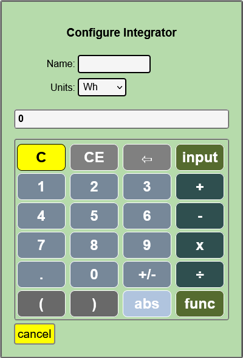
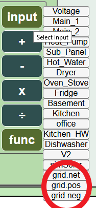
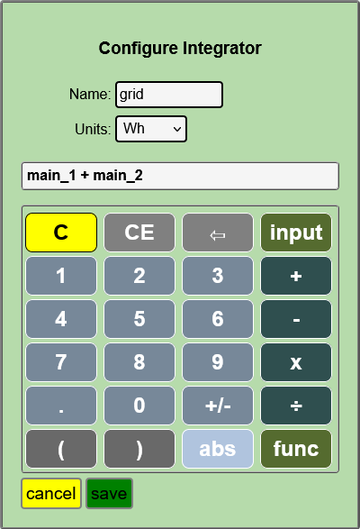
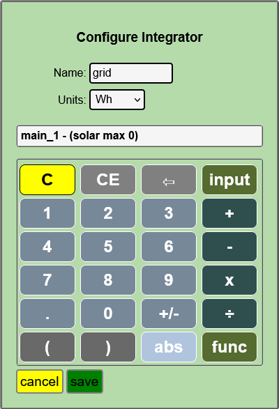
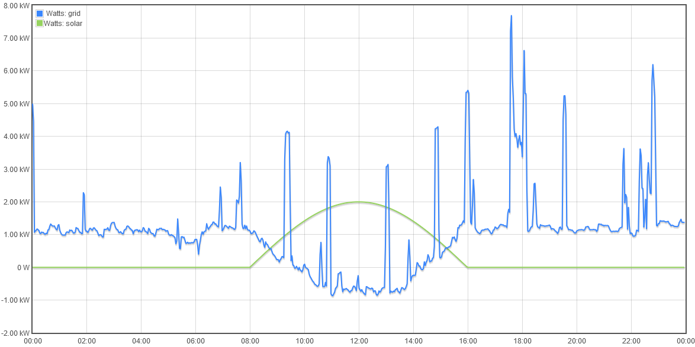
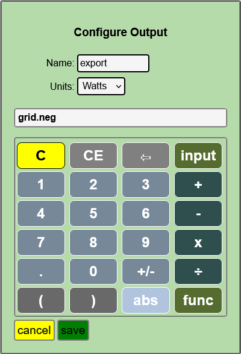
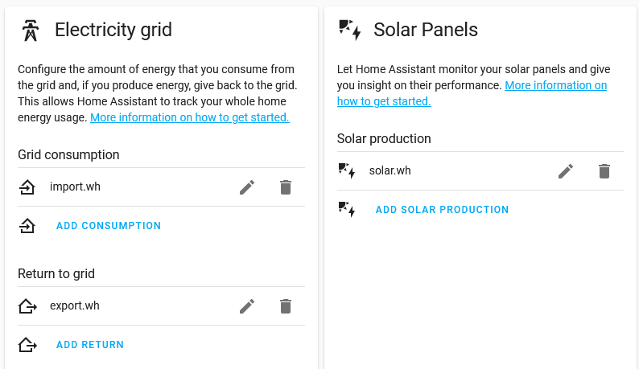

============
Integrators
============

What are integrators?
----------------------

The datalog provides high speed access to all monotonic data derived 
directly from the datalog or indirectly with output Scripts.  That is to say, if
the total value only increases, or only decreases, everything works just fine.

The exception is where a CT is configured with "allow negative values" as with 
a mains CT where solar or other alternative energy sources can send excess
energy to the grid.  In those cases, the total energy represented is the net 
energy, and is not a monotonically increasing value. Additionally, Scripts that do 
not result in monotonically increasing values may not produce the intended result.

The individual five-second data in the datalog is the signed net energy
imported (+) or exported (-) during each interval. When that data is viewed in a broader context 
of hours, the net does not provide accurate individual import and export values.

To develop the individual total imported and exported energy values,
IoTaWatt needs to process the detail measurements 
to accumulate the sums of the individual positive and negative values,
and to save each as a monotonic series that can
be used in output Scripts.  That's what integrators do.

How they work
-------------

As previously mentioned, the detail data exists in the current datalog.
When you create an integrator, an additional datalog is created to
contain the integrated values. These are called integrations in the mathematical sense, 
not to be confused with combining as with integrations in Home Assistant terminology.

A background Service is started to process the five-second datalog, by default 
beginning 24 hours prior. This takes about ten minutes. The Integrator accumulates
the positive and negative five-second values in the new integration datalog.

When the background process has processed the historical data, it is *synchronized*
with the current log. At this point the Service terminates and the
datalog Service, which maintains the current log, takes on the task of updating
the integration log as an atomic operation when writing new datalog entries.

When the log is synchronized, 
the integrated results are available for use in output Scripts (calculator)

Creating an Integrator
-----------------------

Hover over |Setup| and click |Integrations| in the dropdown buttons.

This will list any integrations that you have already configured, 
and allow you to click |add| to create a new one.  
You can click |edit| on existing integrations to change or delete them.

From here, the process is identical to adding any other output.
For a refresher, see `Adding a new Output <outputs.html>`_ 
Integrations must be uniquely named using alpha-numeric characters and the
underscore (_) character.

The Script that is specified will be integrated to sum the positive and negative components.

Using the data
--------------

Once the Integration is *synchronized*, it should remain so going forward.
When creating a new output Script, there will be three new selections
available in the inputs list.  

They will all begin with the name of the
integration with these appendages:

  .net
    Returns the net value of the Integration script, just as it
    would if the script were used outside of an integration, except that
    the result will be based only on data within the time period defined
    by the Integration log.

  .pos
    Returns the sum of the positive five-second intervals within the requested period.

  .neg
    Returns the sum of the negative five-second intervals within the requested period.

Note that for any period,  .net = .pos + .neg

Tracking Grid import/export with solar
--------------------------------------

To track energy import and export to the grid, use an integration
of a Script that calculates the power flow from the grid (+) and
to the grid (-).

Set "allow negative values" in the config for all mains.
Insure that they indicate positive when importing power (at night).
If they indicate negative at night, reverse the CT or check the
"reverse" box in the config.

Solar inverter connects after mains (most common)
""""""""""""""""""""""""""""""""""""""""""""""""""

The most common service has the solar inverter connected to a breaker
in the service panel, or to the mains cable(s) after the mains CT.
With this configuration, the solar reduces the energy flow in the mains
and will drive the mains negative when generation exceeds energy use.  

    Split-phase mains example

Create an output that is the sum of all of the mains.
Typically a 230V single-phase service will have one main,
a split-phase North-American servive will have two mains and
a three-phase service will have three:

  (single-phase)
    grid = main_1

  (split-phase) 
    grid = main_1 + main_2 

  (three-phase)
    grid = main_1 + main_2 + main_3 

Solar inverter connects before mains
""""""""""""""""""""""""""""""""""""

In this configuration, the solar inverter is connected to the mains feeder
before (on meter side) the mains CT. Solar generation does not effect the energy measured
by the mains CTs.

    Single-phase solar connected before mains.

You must subtract the solar from the grid total:

  (single-phase)
    grid = main_1 - (solar max 0)

  (split-phase) 
    grid = main_1 + main_2 - (solar max 0)

  (three-phase)
    grid = main_1 + main_2 + main_3 - (solar max 0)

Now plot the grid and solar output using graph+ for yesterday.
Hopefully the sun was shining and your plot looks something like this
where you can see the solar directly reduce the grid power.

When you are satisfied the grid output correctly reflects your grid power flow,
delete the grid output and add an integrator named grid with that same Script.

You will see the integration "grid" listed under the Data Logs tab in the Status Display.
Wait about 10-15 minutes for the integration to process the last 24 hours of data.
When the end time is the same as the current log, the integration is "synchronized"
and you can use it to add import and export outputs.
You can reference or query the import and export outputs to get accurate Wh. 

    

Home Assistant Energy
---------------------

If you followed the examples above, configuration of Home Assistant Energy is
simple and easy.  Once you install a Home Assistant IoTaWatt Integration,
configure Energy like this.

.. |Setup| image:: pics/SetupButton.png
    :scale: 60 %
    :alt: **Setup button**

.. |add| image:: pics/addButton.png
    :scale: 60 %
    :alt: **Add button**

.. |edit| image:: pics/editButton.png
    :scale: 70 %
    :alt: **edit button**

