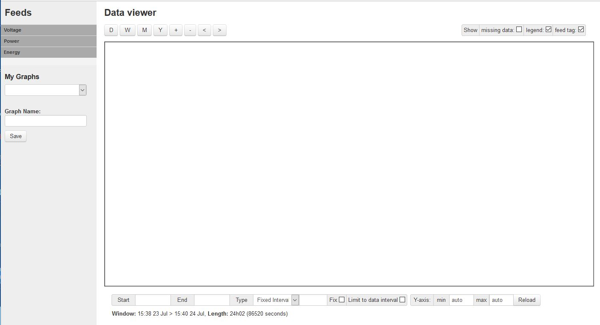
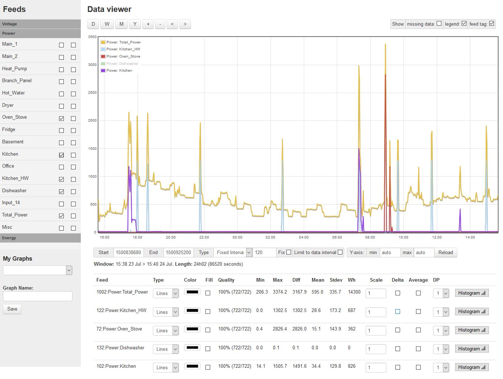

==============
Original Graph
==============

The original local graphing feature was derived from the Emoncms graphing 
application and adapted to report the input and output channels 
of IotaWatt directly. It is available on devices 
connected to the same WiFi network as the IotaWatt or on the 
internet using local port forwarding.

From the configuration app click "Data" and then select"Original Graph" |data|.

Press the Voltage, Power, and Energy tabs under Feeds to list your 
IotaWatt input and output channels. Select the Power tab and then 
select one or more of your channels listed there. Selecting 
Total_Power (actually an output channel that is the sum of Main_1 and Main_2) 
we get the following graph.

.. image:: pics/graphTotalPower.jpg
    :scale: 60 %
    :align: center
    :alt: Total Power Graph

Notice that the graph covers a 24 hour period. 
That's the default. You can select the period using 
the D, W, M, Y buttons at the top, and you can move 
the time frame left or right and zoom in or out.

Back to this graph. It reveals that average power is about 600 watts. 
To be precise, the mean power is 595 watts and the total power 
for the day was 14,300 watt-hours (14.3Kwh) as indicated in the 
feed statistics at the bottom. Wondering what might be causing 
those spikes at various times throughout the day? 
Lets lay some other input channels on top.

Now the story unfolds. Most of the 1000 watt spikes are cycles 
of a point-of-use electric water heater in the Kitchen (Kitche_HW). 
The big spike around 9pm is the Oven/Stove circuit, and the rest 
of the spikes seem to line up with kitchen appliances.

That's just a sample of the power of the graphic presentation 
possible both locally and with essentially the same tool on Emoncms.org. 
Practically speaking, those power spikes are not the meat-and-potatoes 
of home energy use. Other circuits reveal the contribution of workhorse 
appliances like the refrigerator, freezer, 
heat-pump (not active this day), clothes dryer, 
computer and office machines. Kwh can be plotted as well, 
and compared to the whole. With 14 input channels, 
its possible to divide household usage into manageable components.

.. |data| image:: pics/dataButton.png
    :scale: 60 %
    :alt: **Data Button**
