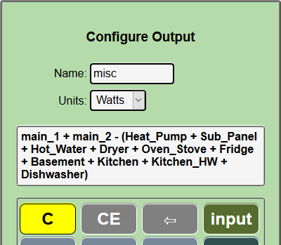
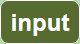
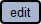

=======
Outputs
=======

Outputs provide useful values that are computed from 
input channel values using a calculator like interface. 
For instance, in a typical US installation, there are two MAIN circuits, 
the sum of the two is the total power into a panel.  
Its nice to know at a glance what that total is, 
but the two mains are measured separately using two input channels.  
We need a way to add them together to display the total usage.

Hover over |Setup| and click |Outputs| in the dropdown buttons.

.. image:: pics/outputs/outputsDisplay.png
    :scale: 60 %
    :align: center
    :alt: Outputs Display

This screen will list any outputs that you have already configured, 
and allow you to click |add| to create new ones.  
You can click |edit| on existing outputs to change or delete them.  
There is no practical limit to the number of outputs that you may create.  
The only requirement is that they be uniquely named.

Adding a new Output
-------------------

So lets click |add|:

.. image:: pics/outputs/newOutput.png
    :scale: 60 %
    :align: center
    :alt: New Output

This is the *calculator* interface that IoTaWatt uses to specify 
how to calculate an output using input channel values.
A script is created that IoTaWatt uses to compute the value when 
needed.  
It works just like the simple four function calculators we are all used to, 
and using the |input| key, you can select 
input channel values to be used in the formula that you are creating. 
The resulting expression is evaluated left to right,
*there is no operator hierarchy*, but 
expressions within parenthesis will be evaluated first::

       1 + 2 x 3 will yield 9
       1 + ( 2 x 3 ) will yield 7

Two additional functions `min` and `max` can be selected using the function button.

.. image:: pics/outputs/funcList.png
    :scale: 60 %
    :align: center

These are binary functions just like + and x that operate on the operands to their left and right.
The `min` function will return the lesser of the two operands and `max` the greater.::

        3 max 25 will yield 25
        -4 min 0 will yield -4
        -4 max 0 will yield 0

So lets make an output channel that combines two main inputs called *main_1* 
and *main_2*. We enter the name total_power in the **Name:** box and hover 
over the |input| button of the calculator to see a list of the inputs.

.. image:: pics/outputs/selectInput.png
    :scale: 60 %
    :align: center
    :alt: Input Select Dropdown

Select main_1 from the list and it will appear in the 
calculator formula display.
Next click on the |plusKey|, then repeat the input process selecting Main_2.

.. image:: pics/outputs/totalPowerOutput.png
    :scale: 60 %
    :align: center
    :alt: total_power output

Easy as that.  Now press |save| to return to the outputs list.  
Your new output should appear within a second or two.

.. image:: pics/outputs/outputsList.png
    :scale: 60 %
    :align: center
    :alt: outputs list

Now go back to the Channels Status screen and see that the new output channel 
is listed and indeed has a value that is the sum of the 
two inputs *main_1* and *main_2*.

.. image:: pics/outputs/outputsStatus.png
    :scale: 60 %
    :align: center
    :alt: outputs status

Some other useful outputs would be:

    *   Power used in a solar PV system, calculated by adding the 
        Solar inverter input to the (signed) Main input.
        If for instance the inverter were putting out 4500
        watts and your Main(s) indicated an outflow represented as -3100
        watts, local usage would be 1400 watts with 3100 watts exported.
        

    *   Where the Main(s) are monitored and selected circuits within the panel
        are also measured, you can create an output that shows the aggregate
        unmeasured usage by subtracting the measured inputs from the Mains as
        the *misc* output in the status display above.
        That output is defined:

.. |save| image:: pics/SaveButton.png
    :scale: 50 %
    :alt: **Save**
    
.. |Setup| image:: pics/SetupButton.png
    :scale: 60 %
    :alt: **Setup button**

    
.. |add| image:: pics/addButton.png
    :scale: 70 %
    :alt: **add button**

