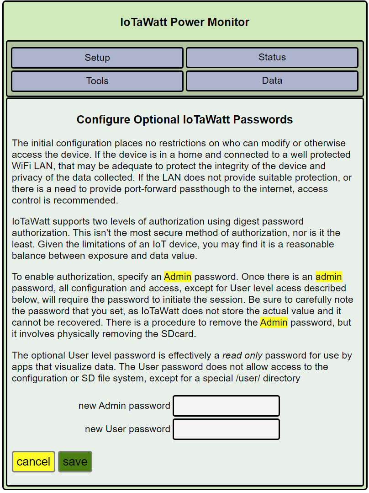

Passwords Configuration
=======================

Successful startup will be indicated by a dull green glow on the LED.
If the LED is off, or blinking a sequence,
see the `troubleshooting <troubleshooting.html>`_ section.

After successful startup, you can connect to the device with your 
web browser to access the configuration app. 
Use the url: ``http://iotawatt.local`` or, if your device
has been renamed, use ``http://<newname>.local``. The configuration app starts with a row of buttons:

.. image:: pics/mainMenu.png
    :scale: 75 %
    :align: center
    :alt: Main Menu image

Hover over |Setup| and click |Passwords| in the dropdown menu.

Open Access by Default
----------------------
The initial configuration has no access restrictions for reading or modifying device data or configurations.
If the device is exposed to the internet, then it can be read and modified from the internet without additional protections.
If untrusted actors can jon your local network (WiFi, LAN) then those actors can read and modify without additional protections. 

Dual Level Authorization
------------------------
IoTaWatt supports two levels of authorization using digest password authorization. 
This isn't the most secure method of authorization, nor is it the least. 
Given the limitations of an IoT device, you may find it is a reasonable balance between exposure and data value.

Level 1: Administrative Authorization
-------------------------------------
To enable authorization, specify an Admin password. 
Once enabled, all configuration and access, except for User level acess described below, will require the password. 
The username will be: ``admin``
Be sure to carefully note the password that you set, as IoTaWatt does not store the actual value and it cannot be recovered. 
There is a procedure to remove the Admin password, but it involves physically removing the SDcard.

Level 2: User Authorization
---------------------------
The optional User level password is effectively a read only password for use by apps that visualize data. 
The username will be: ``user``
??? have not tried it yet, is that true ???
The User password does not allow access to the configuration or SD file system, except for a special /user/ directory

Save
~~~~
Click |save|. Your changes will be saved. 
????? Not sure if it restarts ?????
Once you restart the configuration application from ``http://<newname>.local`` you will be promted for the Administrative passsword.

The next step is `VT Configuration <VTconfig.html>`__

.. |Setup| image:: pics/SetupButton.png
    :scale: 60 %
    :alt: **Setup button**

.. |Passwords| image:: pics/PasswordsButton.png
    :scale: 60 %
    :alt: **Passwords button**

.. |save| image:: pics/SaveButton.png
    :scale: 50 %
    :alt: **Save**