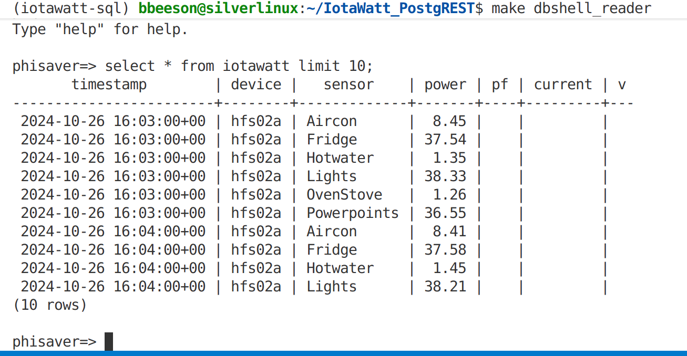
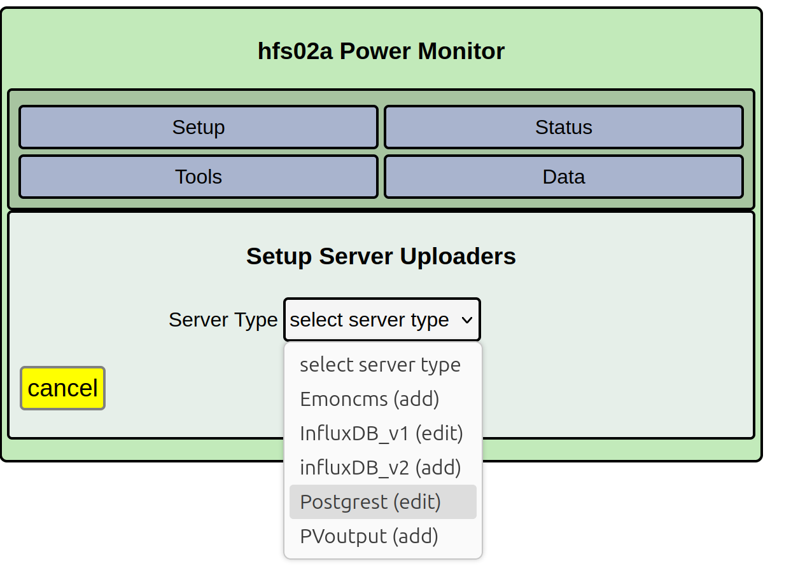
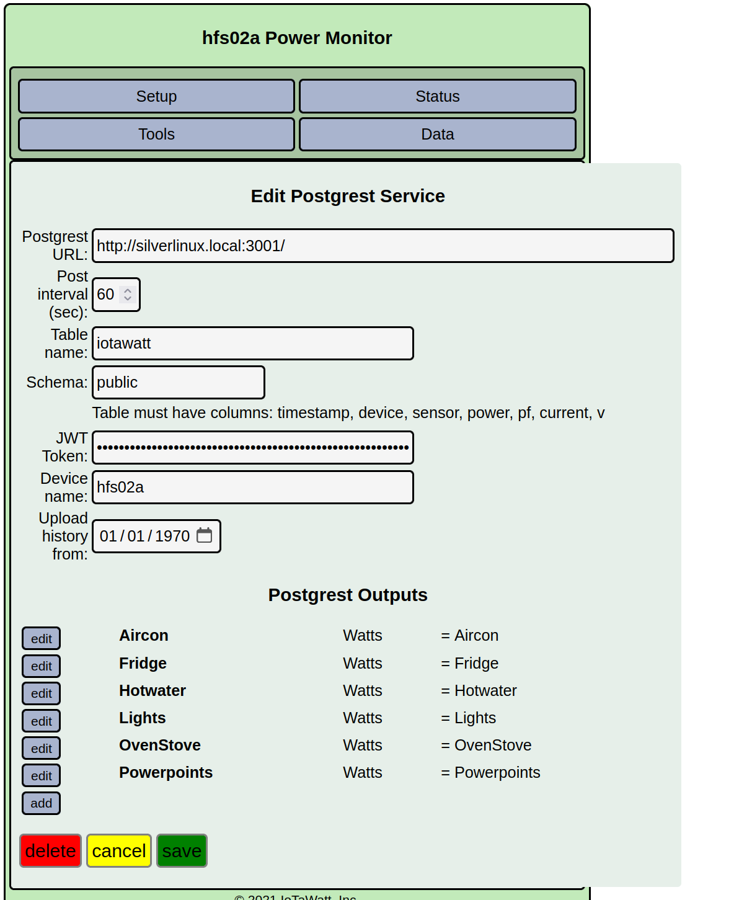

=========
PostgREST
=========

The PostgREST uploader POSTs IoTaWatt measurements into PostgreSQL_ via a PostgREST_ endpoint. 

It is designed to write to TimescaleDB, a time-series extension to PostgreSQL, but
it works equally well with vanilla PostgreSQL. It does not work with other SQL databases like MySQL.

It is designed for visualisation by Phisaver_, but it can be used 
more generally to "write IotaWatt data to an SQL table". 

Design Background
-----------------

PostgreSQL has a custom interface language not based on HTTP. Normally a psql client handles this. We use PostgREST_
to provide a HTTP RESTful interface to match other IoTaWatt uploaders.

Unlike schema-less services like InfluxDB, SQL databases need a fixed table structure. There a few
tradeoffs between 'narrow' and 'wide' designs. We selected a wide design as we know the metrics (Volts, Watts)
in advance and it is simpler to insert and query.
 
Configure PostgREST
-------------------

Before touching the IoTaWatt you must expose a REST API backed by a suitable table. 

Consult the PostgREST_ documentation and the IotaWatt_Postgrest_ repo for docker container and scripts, in particular a JWT token generator.

A minimal setup is:

1. Install PostgreSQL_ and PostgREST_. The upstream PostgREST
   quickstart walks through configuring ``postgrest.conf`` with your database
   credentials and optional JWT secret.
2. Create a dedicated database role for IoTaWatt and grant it the ability to
   insert into your target table. Use JWT auth - uploader
   sends an Authorization header when a token is provided.
3. Create the table that PostgREST will expose. The uploader always sends the
   following columns::

        CREATE TABLE iotawatt (
            timestamp   TIMESTAMPTZ NOT NULL,
            device      TEXT        NOT NULL,
            sensor      TEXT        NOT NULL,
            power       DOUBLE PRECISION,
            pf          DOUBLE PRECISION,
            current     DOUBLE PRECISION,
            v           DOUBLE PRECISION
        );

   
4. Generate a JWT token for the IoTaWatt role via ``generate_jwt.py``. See the IotaWatt_Postgrest_ repo for scripts to do this.

   Point PostgREST to that table and verify that ``GET /iotawatt?device=eq.my_device&limit=1`` returns JSON. You'll need
   to include the JWT token in the Authorization header.
   

5. This is the outcome you're aiming for:

Configure IoTaWatt
------------------

Open the IoTaWatt configuration app, hover over Setup and choose
uploaders. Select **PostgREST** from the uploader list.

The PostgREST form mirrors other uploader dialogs and reuses the same
calculator for outputs. When a field behaves exactly like the other
uploaders (for example *post interval*, *bulk send*, service start/stop, or
backfill controls) the details are intentionally omitted here—see the main docs
for those fundamentals.

**PostgREST URL**
    Base URL of your PostgREST service, e.g. ``http://db.example.com:3000``.
    The uploader builds
    resource paths internally based on the schema/table values that you enter
    below.

**Table name & Schema**
    Identify the REST resource to post into (``schema.table``). Leave the schema
    as ``public`` unless your PostgREST configuration exposes another schema.

**Device name**
    Label stored in the ``device`` column. The default ``$device`` is replaced
    with the IoTaWatt's configured name. Any other literal text is used as-is.

**JWT token**
    Paste a PostgREST bearer token for your API authentication. 

**Outputs**
    Build one or more calculator scripts exactly as you would for other
    uploaders. Each script produces a row with ``timestamp`` and ``sensor``
    plus *one* of the numeric columns. Note that multiple outputs would be needed to
    populate numeric columns in a single row (i.e. Watts and Volts for the same sensor) but
    this is *not* supported at present.

After saving, the PostgREST uploader appears in the status display. Use the
Uploaders tab to confirm it is "Running" and that the *Last update* time
advances. Diagramming or dashboard tools (Grafana, PhiSaver, SQL clients) can
query the underlying table - see an example below.

.. image:: pics/postgrest/postgrest-phisaver.png
    :scale: 60 %
    :align: center
    :alt: **PhiSaver Visualisation using Postgres Data**

.. _PostgREST: https://postgrest.org
.. _PostgreSQL: https://www.postgresql.org/
.. _PhiSaver: https://phisaver.com/
.. _IotaWatt_Postgrest: https://github.com/PhiSaver/IotaWatt_PostgREST
