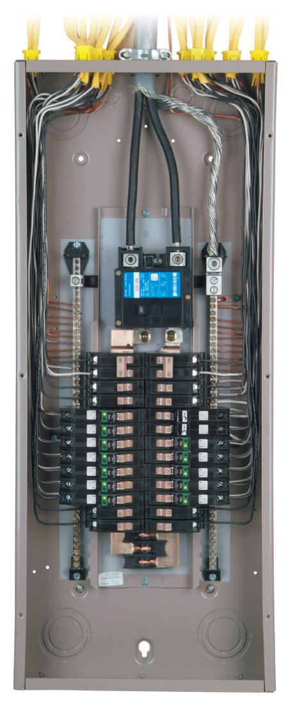

========================
Split-Phase Installation
========================

This chapter assumes the reader has read the `CT Basics <CTbasics.html>`_ section.

--------------------
What is split-phase?
--------------------
Worldwide, virtually all of the residential power delivered to residential homes
is 230V-240V single phase.
In North America, the single-phase 240V supply is split so that there are two 120V
legs that are typically used for lighting and light-duty appliances.
To learn more see the
`Split-Phase Wiki <https://en.wikipedia.org/wiki/Split-phase_electric_power>`_.

------------------------
Split-phase load centers
------------------------

    Maybe neater than normal load center

A typical split-phase load center has two Main circuit breakers, one for each of the two
"legs" coming from the service entrance.  There is also a third neutral wire that is
directly connected to the neutral bus - a long bar with holes and screws to connect
conductors.  Another ground bus is provided which is connected to a reliable local
earth connection like a ground stake.  
In most entrance panels, but not sub-panels, the neutral and ground busses are "bonded" (connected together).

The service is typically described in terms of the amperage rating of the Mains 
circuit breakers or fuses.  Most common are "100A service" and "200A service".

See the North America section of this Load-Center Wiki_.
to see how the split-phases correspond to alternating breaker rows. 

.. _Wiki: https://en.wikipedia.org/wiki/Distribution_board

----------------------
Monitoring split phase
----------------------
When monitoring a circuit in a split phase service, it's helpful to
recognize exactly which of the mains circuits it is utilizing.
There are three possibilities:

............
120V phase A
............ 
    These circuits are two conductor (plus ground) and typically use
    a black conductor connected to the circuit breaker and a white
    conductor connected to the neutral bus. As described in the Wiki_,
    circuit breakers in odd rows will be on phase A.
    Odd rows include breakers numbered [1,2] [5,6] [9,10]..etc.

............
120V phase B
............ 
    Same as above, except circuit breakers will be in the even rows
    with breakers numbered [3,4] [7,8] [11,12]... etc.

....
240V
....
    These circuits are typically larger appliances like Hot-Water,
    Range, Pumps, Electric Heat, Dryers, Heat-pumps, sub-panels, 
    and Air-conditioners. They use two circuit breakers in adjascent
    rows, so one of the breakers is on phase A and the other is on phase B.
    
    As explained in the `CT Basics <CTbasics.html>`_ section, 240V 
    loads can be two-wire or three-wire.

    Two-wire loads typically use two conductor cable with the white and 
    black conductors connected to the two circuit-breakers.  For these 
    circuits, a single CT can be placed on either one of the two conductors
    and the "double" box checked to indicate to IoTaWatt that the voltage
    is doubled to 240V. Orientation of the CT is dependent on the row that
    the CT is associated with.

    Three-wire loads typically use three conductor cable with black, red,
    and white conductors.  The red and black are connected to the two 
    breakers and the white is connected to neutral.  These loads must 
    be measured with two CTs, one on the red and one on the black, or 
    by passing the two conductors through one CT in opposite directions 
    so that the resulting orientation of the CT is correct for the row
    of the breaker that each conductor is connected to. An illustration
    can be found in the `CT Basics <CTbasics.html>`_ section.

-----------------
Voltage Reference
-----------------
The voltage between the two mains conductors is nominally 240V.
That is broken down into two 120V potentials between each of the
Mains and the neutral, but unless they are in perfect balance,
there will always be a difference in voltage between the two phases.
That said, the difference in most situations is practically negligible
and the sum of the two will always equal the voltage between the two Mains.

This is an important point, because in order to measure real-power,
what your meter measures and what you pay for, it's necessary to also have
a reference voltage on that circuit.

IoTaWatt supports multiple voltage references, but as a practical
matter, you only need one to measure any of the three circuits 
described above.

The simplest and most effective reference is a 120V wall
transformer connected to an ordinary 120V plug as close to the 
load center as possible. That will provide a reference for the
phase it is plugged into, *and a reference that is the exact 
opposite of the other phase*, or to put it another way, 
the *reverse* of the other phase. 

--------------------
Mains CT orientation
--------------------
The first CTs to be installed should be the Mains.  

    **As mentioned in multiple discussions, this is a job for someone 
    familiar with the working with live, partially exposed electrical
    wiring and familiar with all of the risk factors.
    An electrician is recommended.**

Because each of the Mains is on a different phase, 
and we are using the same voltage reference for both phases, we need
to reverse one of them so that the current it measures aligns with
the reversed voltage reference.  So which one?  The answer is that because
the wall transformer plug is not polarized as well as other uncontrolled
factors, we don't know yet.  

So what we do is just install
the CTs with opposite orientation, `configure them <CTconfig.html>`_, and 
look at the status display of the IoTaWatt.  If reversed,
they will show a ↺ symbol. To correct this, you can do one of two things.

- Reverse the wall transformer in its socket.
- Click the "reverse" box in the VT configuration menu.

Now, the two Mains inputs should show the Watts for each Main and
no reverse ↺.

-------------------
Load CT orientation
-------------------

First, it's important to note that the only consequence of installing 
a load CT backward is that it
will show a ↺ symbol next to the input in the status display. 
This indicates that IoTaWatt has recognized that the voltage and 
current are opposite and is producing the correct measurement
by reversing the output numerically.  There is no error attributable
to this correction. If the ↺ symbol doesn't bother you, you can place the CTs without
regard for phase.

Another approach is to simply install the CTs without regard for phase orientation
and then simply check the "reverse" box for any inputs that show the ↺ symbol
in the status display or physically reverse those CTs in the load center.

To install with correct orientation initially, the easiest method is to install
one CT on an active circuit and note if the ↺ symbol appears in the status
display.  If so, reverse that CT.  Now note which way the correctly oriented CT is
installed and whether its row is even or odd.

If it's an even row, all of the CTs that you install on even row circuit-breakers
should be installed with the same orientation and the odd row circuit breakers with
the opposite orientation.
