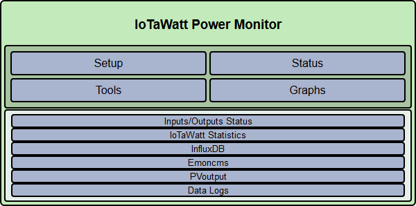
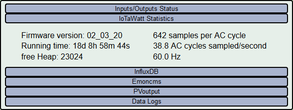
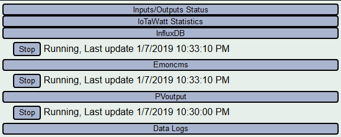
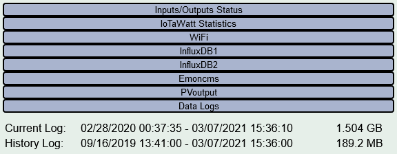

=====================
Device Status Display
=====================

Overview
--------

The configuration app can provide a continuously 
updating display of many aspects of IoTaWatt operation.  
The output is organized into expandable tabs containing 
various categories of information. 
Simply click the |Status| button.

The initial display will always have the Inputs/Outputs Status tab expanded.  
Simply clicking on that tab, or any of the other tabs, 
will toggle them between expanded and collapsed. 
The various tabs as of this writing are detailed as follows:

Inputs/Outputs
--------------

.. image:: pics/status/inputsOutputsDisplay.png
    :scale: 60 %
    :align: center
    :alt: Inputs/Outputs Display

This tab lists all of the configured input channels on the left, 
and all of the defined outputs on the right. 
Both columns show the current measurement value. 
Input channels values are in Watts or Volts for CT and VT 
channels respectively.  
CT channels also will display the power-factor (PF) 
when the power is sufficient to develop that reliably.
Output channel values are in the units configured.  
They may be Volts, Watts, Amps, VA, Hz, or PF.
All values are damped, which is to say they are averaged 
with an exponential decay 
algorithm so that they will not jump around excessively.  
That said, the algorithm does respond to large changes quickly and 
settles in on small changes within a few seconds.

Statistics
----------

The statistics tab provides insight into the current operation of the 
IoTaWatt with the following information:
    
    * **Firmware version:** Release of IoTaWatt firmware.
    * **Running Time:** Since last restart.
    * **free Heap:** An indication of the working memory 
      available to the firmware.
    * **Samples per AC cycle:** Average samples IoTaWatt is 
      achieving when sampling a channel.
    * **AC cycles sampled/second:** Average number of channels 
      that are measured per second.
    * **Hz:** Current AC frequency.

Web Servers
-----------

These tabs appear when `data upload <webServer.html>`_ to PVoutput, 
Emoncms, influxDB has been configured.  
They indicate the state of the services that are responsible for 
sending the data to the respective server.

    **Start/Stop button:**  Use to pause and resume uploading data.
    This button works asynchronously, and may take awhile 
    to perform the action. Pressing multiple time may cause 
    it to go out of sync.  Use it carefully.

    **Running/Stopped:** The current state of the service.

    **Last Update:** Data/time of the last data sent to the server.

Data Logs
---------

This tab displays the date/time of the first and last entry 
in both the Current Log and the History Log.  
These dates may take a few seconds to become accurate as the IoTaWatt starts. 
The History Log should begin from the data/time when the 
IoTaWatt was first installed, 
or when the History log was last created after being deleted.  
It should increment every minute while the unit is running.

The Current Log contains up to a year's worth of data, 
and maintains that data at 5 second resolution.  
When the approximate year capacity is reached, it will "wrap" back around 
and begin writing over the oldest entries.  
Newer logs will show the same start date as the History Log.  
As the log ages and reaches capacity, the start date/time 
will advance at 5 second intervals along with the 
ending date/time.
