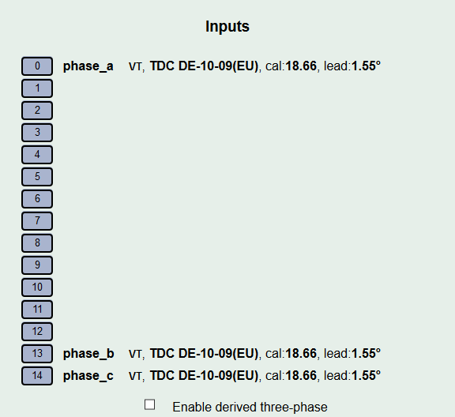
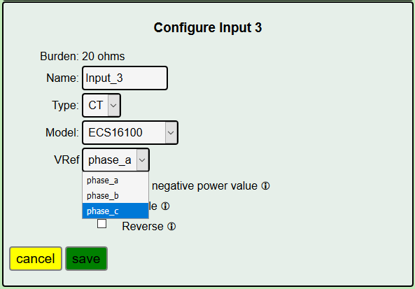
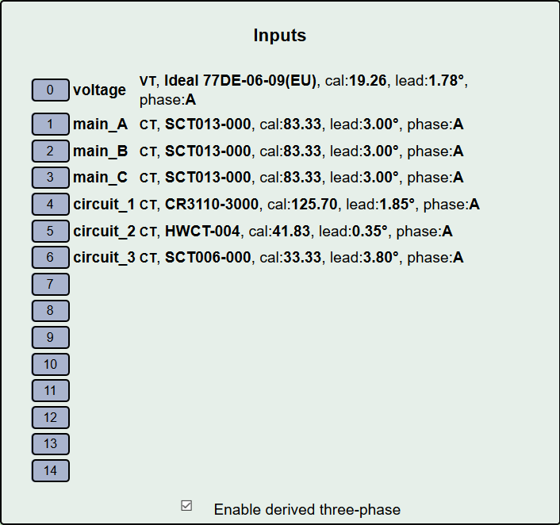
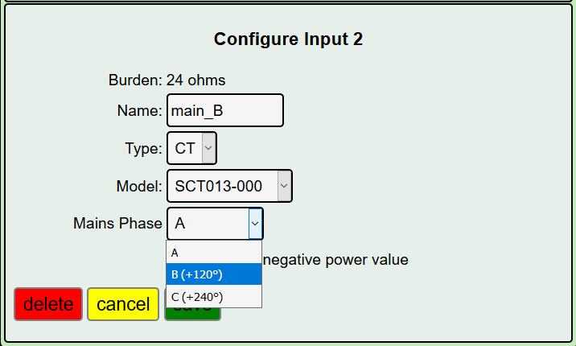

=================
Three-phase Power
=================

IoTaWatt has the capability to measure power in polyphase systems. 
In the interest of keeping the user interface simple for the majority 
of users with single phase power, the details are disguised and/or hidden
until needed. There has been a lot of interest in using IoTaWatt
for three-phase monitoring, particularly in three phase countries like
Australia and Germany. For home energy monitoring, the *derived reference*
method is very popular.

As explained in the introductory single phase section, 
a voltage reference is needed to measure real power. 
The challenge with three-phase power is to obtain 
three different voltage/phase reference signals. 
IoTaWatt can do this by two different methods: 

    **Direct Reference** uses three discrete voltage transformers 
    or VTs, each one plugged into a circuit on a different phase. 
    The primary advantage is voltage accuracy, while the 
    disadvantages are that the extra VTs add cost, require using 
    two of the inputs, and require plugs on each phase 
    in proximity to the IoTaWatt.

    **Derived Reference** uses a single voltage transformer 
    and *derives* a reference voltage/phase for the other two 
    phases by numerically shifting the phase of the single 
    reference by 120° or 240°. The primary advantage is 
    low cost and convenience of installation. 
    The disadvantage is that large variations in voltage 
    between phases may result in decreased accuracy.

Configuring Direct Reference
----------------------------

Connecting additional VTs
^^^^^^^^^^^^^^^^^^^^^^^^^

To use Direct Reference three-phase power measurement, 
it's necessary to install two additional 
VTs (total of three), and to plug each of them into a 
receptacle that is supplied by a unique phase. 

Version 5 of IoTaWatt, available second quarter 2019,
will have native plugs to connect the additional VTs.
This tutorial will assume you have the new version 5
IoTaWatt.

The additional VTs will plug into two sockets at the rear
of the unit.  They are labelled VT-13 and VT-14.
When these are used, the standard channel 13 and 14
jacks should not be used.

.. image:: pics/V5VTinputs.jpg
    :scale: 10 %
    :align: center
    :alt: **V5 VT Inputs**

Configuring the voltage inputs
^^^^^^^^^^^^^^^^^^^^^^^^^^^^^^

Now the additional VTs can be configured and calibrated. 
Do this in the same way that the first VT was configured. 
Click the channel number, click "VT" then specify the model. 
Click Calibrate and calibrate the voltage to match your reference. 
It's not necessary that the VTs be plugged into their 
eventual phase for this step. 
If you have two outlets on any of the phases, 
use those to plug in each VT in turn along with a voltage 
reference while you calibrate. Once calibrated, 
the VTs can be moved to the appropriate phase/socket.

Name each of the phases to uniquely identify each reference. 
You can use phase_A, phase_B etc., 
or maybe use the color coding of your system to be more descriptive - 
voltage_red, voltage_black, voltage_blue (US).

Configuring the CTs
^^^^^^^^^^^^^^^^^^^

Now start adding your CTs. 
The twist here is that because more than one VT is configured, 
an additional selection box is displayed to specify 
which VT is associated with the phase of that particular CT.

If your service is consistently color coded, 
you should know the phase by the color of the conductor 
that you clamp the CT onto.

Configuring Derived Reference
-----------------------------

Another way to approach the voltage reference problem in three-phase
is to use the voltage/phase reference of one phase to derive a
reference signal for the other two. While not as exact, this method
can produce good results. The IoTaWatt numerically shifts the single 
voltage/phase reference by 120° or 240° to measure power on the 
additional two legs. Using this method, a three-phase system can 
be monitored with a single VT, just as with single-phase systems.

This chapter explains how to configure IoTaWatt to 
use "Derived Reference". 
It's pretty straightforward.

Configure the VT
^^^^^^^^^^^^^^^^

Set up your IoTaWatt with the voltage reference VT on whatever 
phase of the three-phase is convenient. We will call that phase
A. This is important:

    *However you identify your physical phases, IoTaWatt always 
    identifies the phase that the VT is connected to as phase A.*

The other two virtual phases will be phase B and phase C. 
It doesn't matter where which of the physical phases
your VT is connected to. Your starting point is always A.

There are color coding schemes for the phases, but they vary so 
widely that I'm not going to try to reconcile this scheme 
with any of them. That exercise is left to the reader. 
The good news is that you really don't have to know what 
any of the phases are to complete this setup.

Configure the CTs
^^^^^^^^^^^^^^^^^

Connect CTs to each of the circuits that you want to measure, 
and configure them as described here.

    *Be sure to orient all of the CTs the same way 
    with respect to source and load*. 
    
The following instructions will not work as described 
if any CTs on the derived phases are reversed.

If you've done everything correctly, 
your IoTaWatt status display should be displaying the correct power 
for all of the circuits on phase A, 
and roughly half power for all of the circuits on phases B and C.

Now in the input configuration menu, 
click the box for "Enable derived three-phase" at the bottom.

The configured input channels should now have "phase:A" 
appended to their descriptions. Go to the status display 
and evaluate which of the inputs appear to be showing power 
that is half what is expected. Note them and go back 
to the input configuration screen. If you know the relative 
phase of your circuits, you can just specify them now 
and fast-forward over this "trial and error" approach that follows.

Edit each of the incorrect inputs in turn, 
changing the "Mains Phase" to phase B.

Now go back to the status display and see which inputs
still appear to be about half of the expected value, 
go back to the input menu and change those to phase C.

The status display should now indicate 
the correct power for all of the phase.

This procedure works best when the loads are substantial and
have high power factors.

One additional point. Once you configure inputs to 
indicate mains phase B or C, the "Enable derived three-phase" 
checkbox will remain set and cannot be turned 
off until all of the inputs are reconfigured back to phase A.

Reporting Power
---------------

Once all of the VTs and CTs are configured, 
there are several ways to view the power used. 
For circuits and/or loads that use only one phase, 
the power value displayed for that channel should be correct as is. 
If there are devices that use two or three of the phases, 
you must add the power from each of the phases to get total power. 
For each such device, define an output channel and use the calculator 
to specify adding the component channels. 
If you are reporting the data to a server, 
the data can be tailored with the calculator to send the single 
combined aggregate power for those devices.