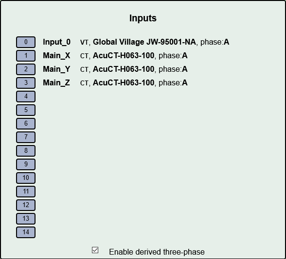
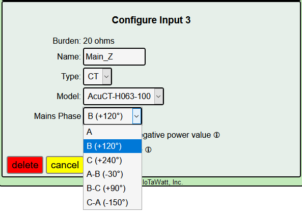
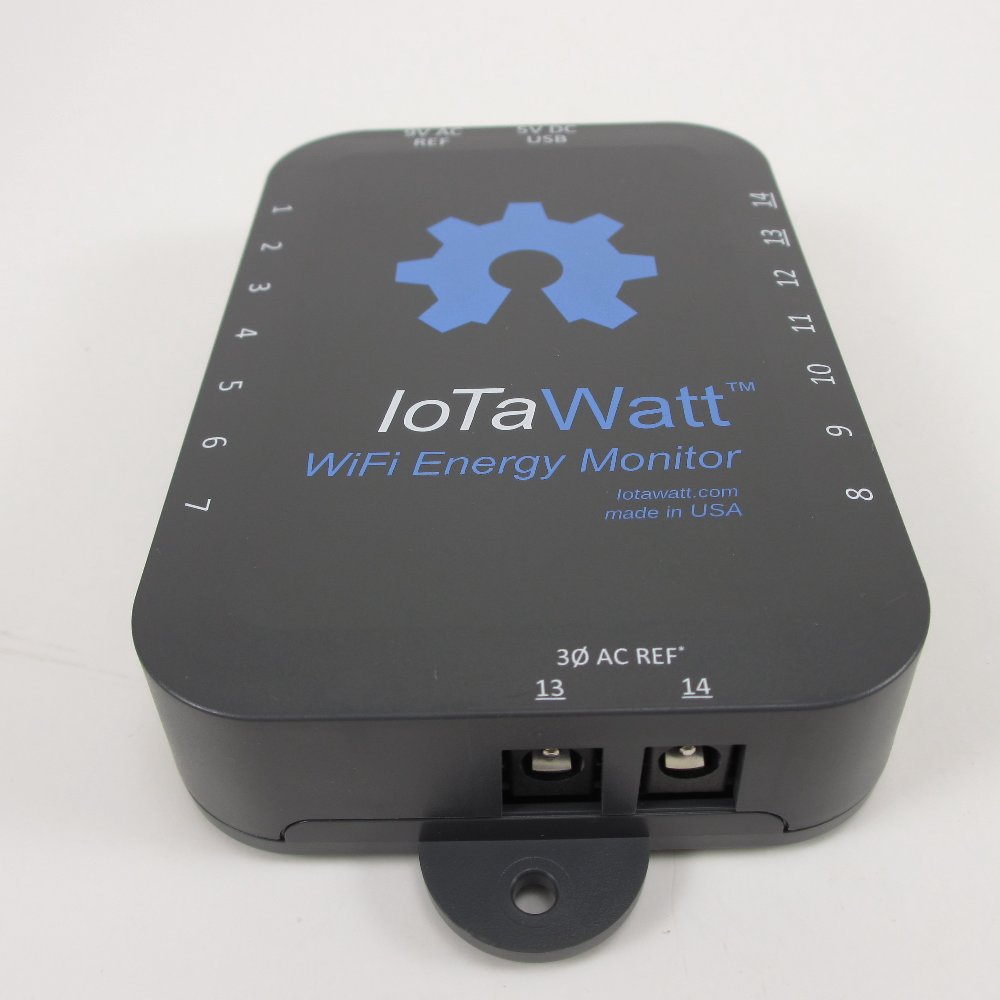
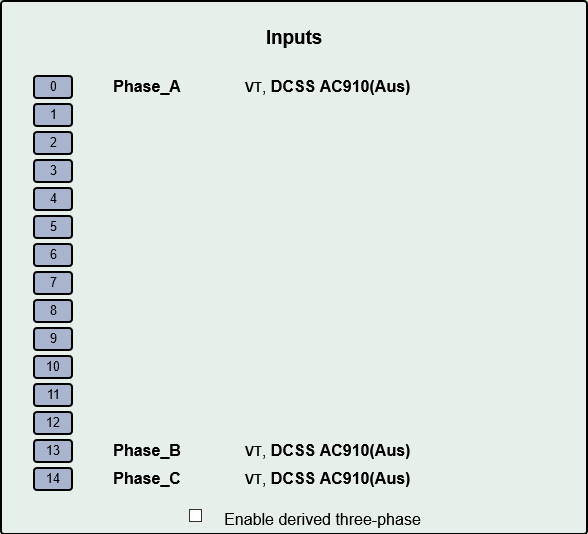
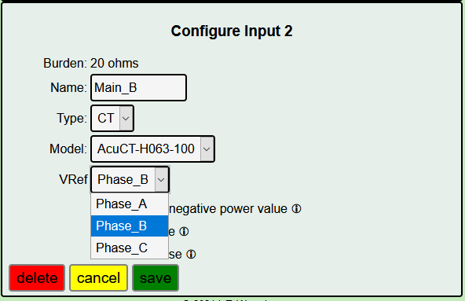
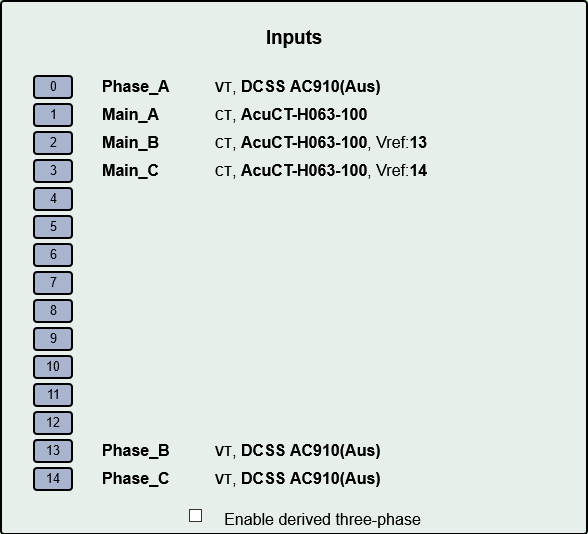

=============================
Three-phase Power
=============================

IoTaWatt has the capability to measure power in polyphase systems. 
In the interest of keeping the user interface simple for the majority 
of users who have single phase power, the details are disguised and/or hidden
until needed. There has been a lot of interest in using IoTaWatt
for three-phase monitoring, particularly in three phase countries like
Australia and Germany. For home energy monitoring, the *derived reference*
method has been overwhelmingly popular.

This chapter explains two methods for measuring a so calld "four wire"
or "wye" system, by far the most common implementation of three-phase.
IoTaWatt can also be used with "three wire" or "delta" systems using 
different methods.

As explained in the introductory single phase section, 
a voltage reference is needed to measure real power. 
The challenge with three-phase power is to obtain 
three different voltage/phase reference signals. 
IoTaWatt can do this by two different methods: 

    **Derived Reference** uses a single voltage transformer 
    and *derives* a reference voltage/phase for the other two 
    phases by numerically shifting the phase of the single 
    reference by 120° or 240°. The primary advantage is 
    low cost and convenience of installation. 
    The disadvantage is that large variations in voltage 
    between phases may result in decreased accuracy.

    **Direct Reference** uses three discrete voltage transformers 
    or VTs, each one plugged into a circuit on a different phase. 
    The primary advantage is voltage accuracy, while the 
    disadvantages are that the extra VTs add cost, use 
    two of the 14 inputs for the additional VTs, and require plugs on each phase 
    in proximity to the IoTaWatt.
    
Configuring Derived Reference
-----------------------------

Derived reference uses a single voltage reference VT and `derives`
the other two signals by phase-shifting. 
While not as exact as direct reference, it produces very good results 
and is the overwhelming choice of residential three-phase users.

This chapter explains how to configure IoTaWatt to 
use "Derived Reference". A word of caution:

    *There are 36 different combinations of CT orientation
    and phase assignment.  Only one of them is correct.  This simple 
    procedure, when followed methodically, will avoid the common pitfalls suffered
    by those who try to stumble on the solution.*

Start by getting the mains installed and configured correctly.  Everything will
fall together from there.

Install and Configure the CTs
^^^^^^^^^^^^^^^^^^^^^^^^^^^^^

Install the three mains CTs on the incoming three-phase 
lines. If the CTs have an arrow, install them so that the
arrow points toward the mains breaker. This is very important:

    *Be sure to orient all of the CTs the same way 
    with respect to source and load. By doing so, you 
    reduce the number of possible incorrect solutions to 5.* 

Connect the CTs to the IoTaWatt and use the `inputs` setup to
set the CT model. Check the *allow negative values* box for each.

Configure the VT
^^^^^^^^^^^^^^^^

Set up your IoTaWatt with the voltage reference VT on whatever 
phase of the three-phase is convenient. We will call that phase
A. This is important:

    *However you identify your physical phases, IoTaWatt always 
    identifies the phase that the VT is connected to as phase A.*

The other two `derived` phases will be phase B and phase C. 
It doesn't matter which of the physical phases
your VT is connected to. Your starting point is always A.

There are color coding schemes for the phases, but they vary widely,
so no attempt will be made to reconcile these instructions with
colors or local alphanumerical designations.  If your system uses
designations A, B and C for the phases, it would avoid confusion if
the VT could be plugged into your phase A. 
The good news is that you really don't have to know what 
any of the phases are to complete this setup.

Identify Phase A 
^^^^^^^^^^^^^^^^

For this step, you will need a significant plug-in load, such as 
a hair dryer, toaster, or possibly a high wattage incandescent light.
As previously stated, Phase A is the phase that the VT is connected to.
To identify that phase, connect the load to the same
outlet as the VT.  You may need to temporarily employ a power strip.

While watching the power draw of the three mains on the IoTaWatt status display,
switch on the load.  One of the three mains should change.  To be sure, 
switch the load off, then back on several times. The status display is damped, 
so it takes several seconds to settle on the new value. 
This is phase A.

Note by how much phase A changes when you switch on the load.  You will need
to know that in the next step.  If phase A is negative and decreases when you 
switch on the load, you can either:

        * Reverse the VT in it's socket - or -
        * Check the `reverse` box for **all three** of the mains CTs.

    *There is now only one correct and one incorrect solution.*

Identify the Other Two Phases
^^^^^^^^^^^^^^^^^^^^^^^^^^^^^

At the bottom of the input configuration menu, 
Check `Enable derived three-phase`.
The configured input channels will now have "phase:A" 
appended to their descriptions.

You know which of the three is the `real` phase A. 
Edit the other two and assign to phase B.

Locate another outlet that you know or suspect is not on phase A.
Connect the load and cycle as before.  Notice which main changes.
If it's A, try other outlets until one of the other two phases changes
with the load.

Note by how much the main changes when you cycled the load.  If it's the
same as it was on phase A, then this is phase B, change the remaining 
main to phase C.

If it is significantly less, closer to half the change that you noted on phase A,
then this is phase C. Change it to phase C leaving the remaining phase as B.

Test the load again.  It should increase by the same amount as when it was 
on phase A.

The derived configuration is now complete. Jump to 
`Branch Circuits`_ below.

Configuring Direct Reference
----------------------------

Connecting additional VTs
^^^^^^^^^^^^^^^^^^^^^^^^^

To use Direct Reference three-phase power measurement, 
it's necessary to install two additional 
VTs (total of three), and to plug each of them into a 
receptacle that is supplied by a unique phase. 

Version 5 of IoTaWatt has plugs to connect the additional VTs.
This tutorial will assume you have the version 5
IoTaWatt.

The additional VTs will plug into two sockets at the rear
of the unit.  They are labelled VT-13 and VT-14.
When these are used, the standard channel 13 and 14
jacks cannot not be used for CTs.

Configuring the voltage inputs
^^^^^^^^^^^^^^^^^^^^^^^^^^^^^^

Now the additional VTs can be configured and calibrated. 
Do this in the same way that the first VT was configured. 
Click the channel number, click "VT" then specify the model. 
You can also calibrate the voltage if desired. 
It's not necessary that the VTs be plugged into their 
eventual phase to calibrate. 
If you have two outlets on any of the phases, 
use those to plug in each VT in turn along with a voltage 
reference while you calibrate. Once calibrated, 
the VTs can be moved to the appropriate phase/socket.

Name each of the phases to uniquely identify each reference. 
You can use phase_A, phase_B etc., 
or maybe use the color coding of your system to be more descriptive - 
voltage_red, voltage_black, voltage_blue (US).

Configuring the CTs
^^^^^^^^^^^^^^^^^^^

Now add your mains CTs. 
The twist here is that because more than one VT is configured, 
an additional selection box is displayed to specify 
which VT is associated with the phase of that particular CT.

Set associated Vref in each CT

Branch Circuits
---------------

Like the mains, all of the branch circuit CT should be oriented the same way.
In panels that observe a color convention for the different phases, it 
should be easy to determine the main, and thus the phase, associated with
each branch circuit.

Where the wires are not coded, it will be necessary to trace them back to the main,
or if it's a single-phase branch, cycle it and see which main responds.

North American three-phase panels look very similar to split-phase panels except
rather than alternate between two split-phases, each side alternates through 
the three phases.

If using `derived reference`, simply set the corresponding mains phase in 
each branch CT configuration.  If using `direct reference` set the corresponding 
VT in each branch CT.

Reporting Power
---------------

When all of the VTs and CTs are configured, 
there are several ways to view the power used. 
For circuits and/or loads that use only one phase, 
the power value displayed for that channel should be correct as is. 
If there are devices that use two or three of the phases, 
you must add the power from each of those phases to get total power. 
For each such device, define an output channel and use the calculator 
to specify which channels to add. 
If you are reporting the data to a server, 
the data can be tailored with the calculator to send the single 
combined aggregate power for those devices.