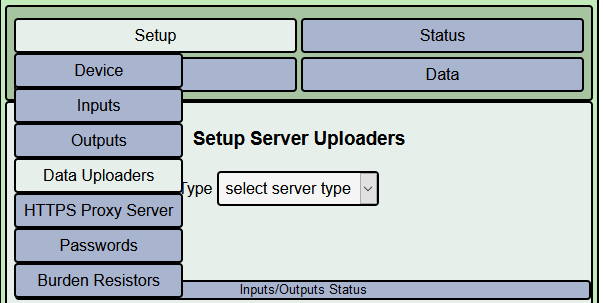
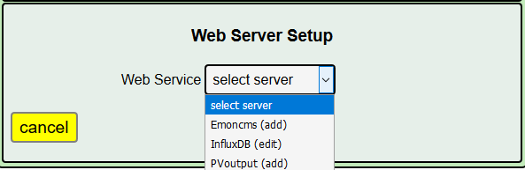
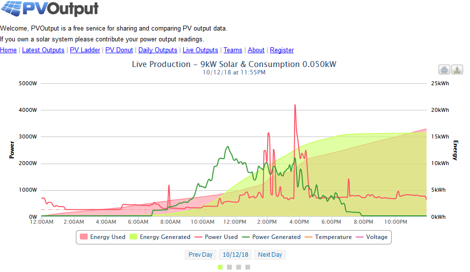
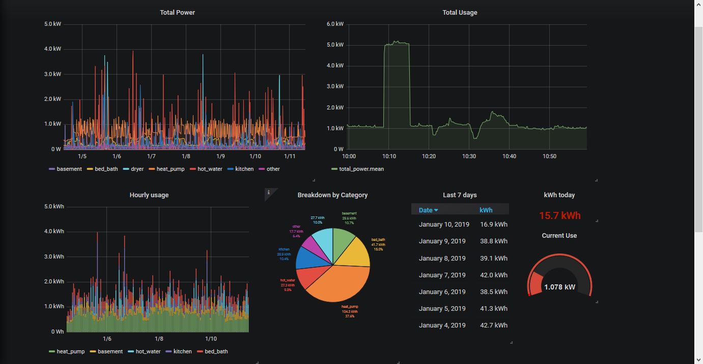
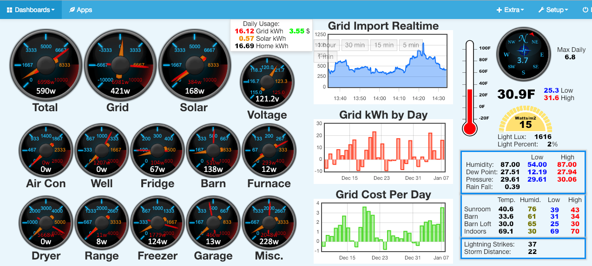

========================
Uploading to Servers
========================

Sending Data to a Web Service
-----------------------------

As a standalone unit, IoTaWatt is a very capable data logger
with an integrated web server/API interface. It can provide
real-time as well as historical data, using the provided 
status-display and the powerful Graph+ application.

That said, there are limitations. While the web server 
typically serves clients on the local network, remote
access requires port forwarding and dynamic DNS to access from
outside. 

There are cloud based services available that will store
uploaded data logger information and present that data to
client applications across the internet. Some of those
databases can also be installed on a private server hosted
by anything from a Raspberry Pi to a commercial hosting
service. IoTaWatt has the capability to upload selected data 
while still maintaining all of its own local logging 
and reporting capabilities.

When one of these services becomes unavailable for any reason,
IoTaWatt will upload the backlog when service is restored,
whether that backlog is a minute or a month.

IoTaWatt can support multiple upload services simultaneously,
so it's not necessary to sacrifice uploading to an influxDB
database in order to participate in the PVoutput project.

To initiate configuration of any web server uploader, hover over
|Setup| and select |DataUploaders|.

click the **Web Service:** dropdown and select a server you would 
like to use from the dropdown list. Each service is designated as 

    *   (add) - New service specification
    *   (edit) - modify existing service configuration (including delete)

When you select a server, the configuration menu for that particular server
will appear. For details of configuring each unique server type, click on
the heading of the corresponding section below.

`PVoutput <PVoutput.html>`_ 
---------------------------

PVOutput is a free online service for sharing and comparing photovoltaic 
solar panel output data. It provides both manual and automatic data 
uploading facilities.

Output data can be graphed, analysed and compared with other PVoutput 
contributors over various time periods. The ability to compare with 
similar systems within close proximity allows both short and 
longer term performance issues to be identified.

While pvoutput is primarily focused on monitoring energy generation, 
it also provides equally capabable facilities to upload and monitor 
energy consumption data from various energy monitoring devices.

Both solar generation and energy consumption data can be 
combined to provide a live 'Net' view of energy being  
generated and consumed.

    PVoutput Graphic Display

`influxDB <influxDB.html>`_
---------------------------

influxDB is a free industrial strength, open-source, schema-less time series 
database. It is fast, efficient and scalable. You can install on a 
Raspberry Pi, a home server, or a commercial web host site.

There are several excellent visualization packages that can be used 
to visualize and report the data.

    grafana dashboard with influxDB

`Emoncms <Emoncms.html>`_
-------------------------

Emoncms is another open-source time series database that was specifically
designed to handle energy monitoring data with robust set of
visualization tools.

    An Emoncms Dashboard

Like influxDB, it can be local hosted on almost any machine, including 
Raspberry Pi, but also is available as a  relatively inexpensive
pay-as-you-go cloud service at emoncms.org.

.. |Setup| image:: pics/SetupButton.png
    :scale: 60 %
    :alt: **Setup button**

