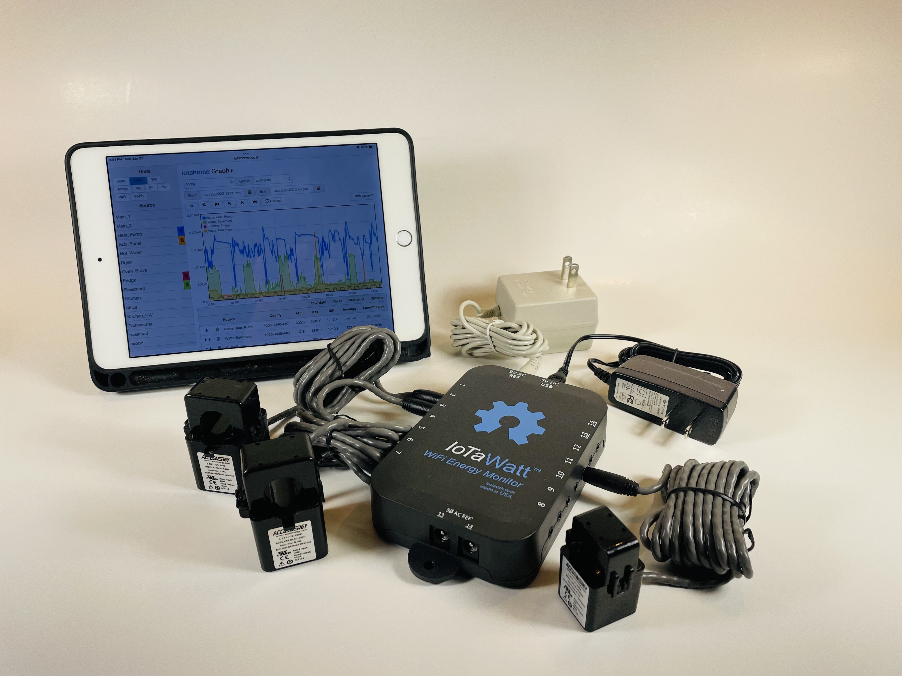

=========================================
IoTaWatt WiFi Electricity Monitor Project
=========================================

IoTaWatt is an open-source, open hardware project to produce an accurate, 
inexpensive and easy to use energy monitor.  
It can use any of dozens of common current transformers and
will report the data locally via integrated web server,
or upload to any of several third-party energy websites/data bases.
Configuration and administration is through an easy to 
use browser based utility running on a 
computer, tablet or smartphone.

    IoTaWatt North America Bundle with two CTs for Mains

IoTaWatt is a full function standalone energy monitor 
with the capability to store and serve up to 15 years (or more) 
of comprehensive usage data and has an integrated web-server with
visualization apps. 
At the same time it can upload data to any and 
all of several (and counting) web based database and reporting systems.

Hardware is open and uses an ESP8266 nodeMCU,
MCP3208 12 bit ADCs, an RTC, and an SDcard.
The commercially manufactured unit is tested and certified to UL 
standards in the US and Canada, 
CE compliant, and FCC compliant and comes with a
custom enclosure and wall mount.

Metrics accumulated to 5 second resolution are Voltage(V), Power(Watts), 
Energy(kWh), VA, and PF.  While not certified to a standard, 
users typically report accuracy within 1% of their revenue meters.

With over 1,000 units sold worldwide over the past year, 
it's now starting to get the attention of energy professionals.

The software project is not commercial, 
however it was necessary to establish a legal entity (IoTaWatt, Inc.) 
in order to manufacture, certify, and sell the hardware worldwide.  
There is an investment in that 
infrastructure that needs to be recovered through sales. You can
visit the `IoTaWatt Stuff Store <https://stuff.iotawatt.com>`_ to get one. 

The unit is manufactured in the USA.

    *   `Documentation <https://iotawatt.readthedocs.io>`_
    *   `Project Website <https://iotawatt.com>`_
    *   `User Forum <https://community.iotawatt.com>`_

.. image:: Docs/pics/status/inputsOutputsDisplay.png
    :scale: 20 %
    :align: left

.. image:: Docs/pics/graphMultichannel.jpg
    :scale: 20 %
    :align: right

.. image:: Docs/pics/outputs/totalPowerOutput.png
    :scale: 20 %
    :align: center

.. image:: Docs/pics/PVoutput/PVoutputDisplay.png
    :scale: 20 %
    :align: center

.. image:: Docs/pics/influxDBGrafana.png
    :scale: 20 %
    :align: center

